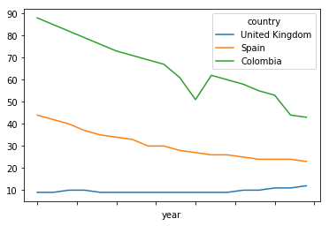
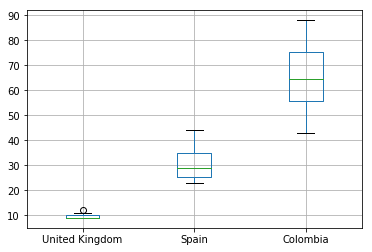
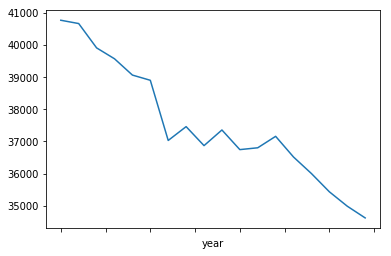
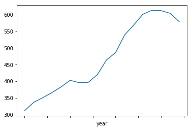
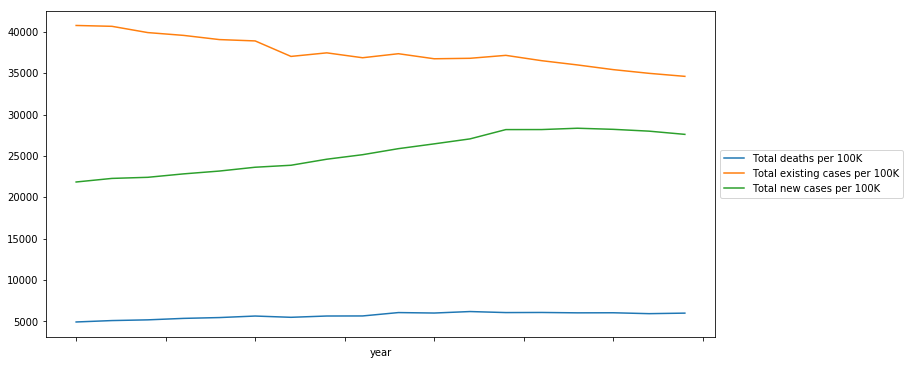
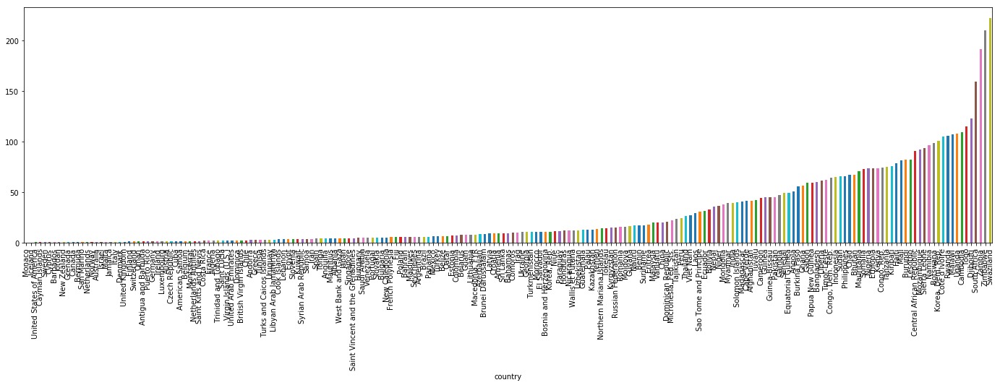
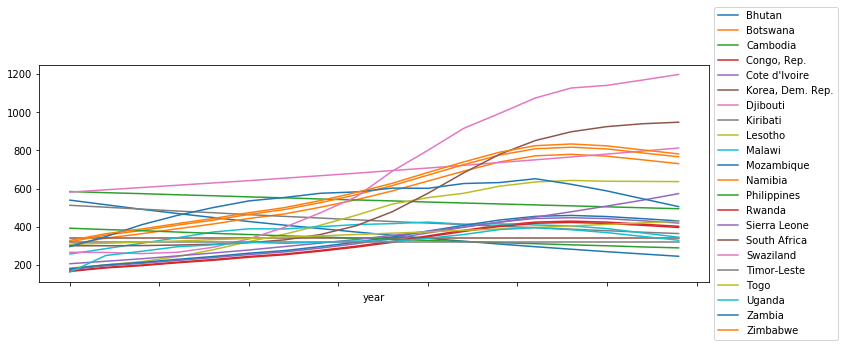
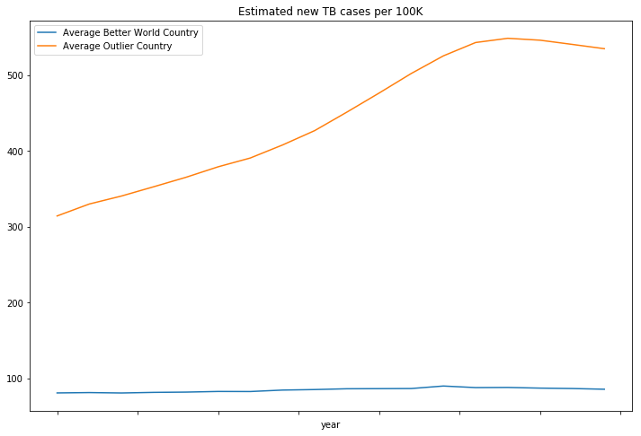
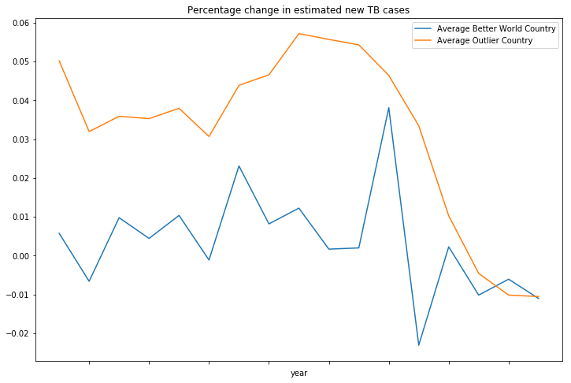
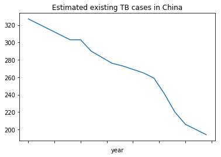

# DataFrame creation in Python

## Loading data from a CSV file

Download Google Spreadsheet data as CSV.


```python
import urllib

tb_deaths_url_csv = 'https://docs.google.com/spreadsheets/d/12uWVH_IlmzJX_75bJ3IH5E-Gqx6-zfbDKNvZqYjUuso/pub?gid=0&output=CSV'
tb_existing_url_csv = 'https://docs.google.com/spreadsheets/d/1X5Jp7Q8pTs3KLJ5JBWKhncVACGsg5v4xu6badNs4C7I/pub?gid=0&output=csv'
tb_new_url_csv = 'https://docs.google.com/spreadsheets/d/1Pl51PcEGlO9Hp4Uh0x2_QM0xVb53p2UDBMPwcnSjFTk/pub?gid=0&output=csv'

local_tb_deaths_file = 'tb_deaths_100.csv'
local_tb_existing_file = 'tb_existing_100.csv'
local_tb_new_file = 'tb_new_100.csv'

deaths_f = urllib.request.urlretrieve(tb_deaths_url_csv, local_tb_deaths_file)
existing_f = urllib.request.urlretrieve(tb_existing_url_csv, local_tb_existing_file)
new_f = urllib.request.urlretrieve(tb_new_url_csv, local_tb_new_file)
```

Read CSV into `DataFrame` by using `read_csv()`. 


```python
import pandas as pd

deaths_df = pd.read_csv(local_tb_deaths_file, index_col = 0, thousands  = ',').T
existing_df = pd.read_csv(local_tb_existing_file, index_col = 0, thousands  = ',').T
new_df = pd.read_csv(local_tb_new_file, index_col = 0, thousands  = ',').T
```

We have specified `index_col` to be 0 since we want the country names to be the row labels. We also specified the `thousands` separator to be ',' so Pandas automatially parses cells as numbers. Then, we `traspose()` the table to make the time series for each country correspond to each column.

We will concentrate on the existing cases for a while. We can use `head()` to check the first few lines.  


```python
existing_df.head()
```


<div>
<style scoped>
    .dataframe tbody tr th:only-of-type {
        vertical-align: middle;
    }

    .dataframe tbody tr th {
        vertical-align: top;
    }

    .dataframe thead th {
        text-align: right;
    }
</style>
<table border="1" class="dataframe">
  <thead>
    <tr style="text-align: right;">
      <th>TB prevalence, all forms (per 100 000 population per year)</th>
      <th>Afghanistan</th>
      <th>Albania</th>
      <th>Algeria</th>
      <th>American Samoa</th>
      <th>Andorra</th>
      <th>Angola</th>
      <th>Anguilla</th>
      <th>Antigua and Barbuda</th>
      <th>Argentina</th>
      <th>Armenia</th>
      <th>...</th>
      <th>Uruguay</th>
      <th>Uzbekistan</th>
      <th>Vanuatu</th>
      <th>Venezuela</th>
      <th>Viet Nam</th>
      <th>Wallis et Futuna</th>
      <th>West Bank and Gaza</th>
      <th>Yemen</th>
      <th>Zambia</th>
      <th>Zimbabwe</th>
    </tr>
  </thead>
  <tbody>
    <tr>
      <th>1990</th>
      <td>436</td>
      <td>42</td>
      <td>45</td>
      <td>42</td>
      <td>39</td>
      <td>514</td>
      <td>38</td>
      <td>16</td>
      <td>96</td>
      <td>52</td>
      <td>...</td>
      <td>35</td>
      <td>114</td>
      <td>278</td>
      <td>46</td>
      <td>365</td>
      <td>126</td>
      <td>55</td>
      <td>265</td>
      <td>436</td>
      <td>409</td>
    </tr>
    <tr>
      <th>1991</th>
      <td>429</td>
      <td>40</td>
      <td>44</td>
      <td>14</td>
      <td>37</td>
      <td>514</td>
      <td>38</td>
      <td>15</td>
      <td>91</td>
      <td>49</td>
      <td>...</td>
      <td>34</td>
      <td>105</td>
      <td>268</td>
      <td>45</td>
      <td>361</td>
      <td>352</td>
      <td>54</td>
      <td>261</td>
      <td>456</td>
      <td>417</td>
    </tr>
    <tr>
      <th>1992</th>
      <td>422</td>
      <td>41</td>
      <td>44</td>
      <td>4</td>
      <td>35</td>
      <td>513</td>
      <td>37</td>
      <td>15</td>
      <td>86</td>
      <td>51</td>
      <td>...</td>
      <td>33</td>
      <td>102</td>
      <td>259</td>
      <td>44</td>
      <td>358</td>
      <td>64</td>
      <td>54</td>
      <td>263</td>
      <td>494</td>
      <td>415</td>
    </tr>
    <tr>
      <th>1993</th>
      <td>415</td>
      <td>42</td>
      <td>43</td>
      <td>18</td>
      <td>33</td>
      <td>512</td>
      <td>37</td>
      <td>14</td>
      <td>82</td>
      <td>55</td>
      <td>...</td>
      <td>32</td>
      <td>118</td>
      <td>250</td>
      <td>43</td>
      <td>354</td>
      <td>174</td>
      <td>52</td>
      <td>253</td>
      <td>526</td>
      <td>419</td>
    </tr>
    <tr>
      <th>1994</th>
      <td>407</td>
      <td>42</td>
      <td>43</td>
      <td>17</td>
      <td>32</td>
      <td>510</td>
      <td>36</td>
      <td>13</td>
      <td>78</td>
      <td>60</td>
      <td>...</td>
      <td>31</td>
      <td>116</td>
      <td>242</td>
      <td>42</td>
      <td>350</td>
      <td>172</td>
      <td>52</td>
      <td>250</td>
      <td>556</td>
      <td>426</td>
    </tr>
  </tbody>
</table>
<p>5 rows × 207 columns</p>
</div>


By using the attribute `columns` we can read and write column names.


```python
existing_df.columns
```


    Index(['Afghanistan', 'Albania', 'Algeria', 'American Samoa', 'Andorra',
           'Angola', 'Anguilla', 'Antigua and Barbuda', 'Argentina', 'Armenia',
           ...
           'Uruguay', 'Uzbekistan', 'Vanuatu', 'Venezuela', 'Viet Nam',
           'Wallis et Futuna', 'West Bank and Gaza', 'Yemen', 'Zambia',
           'Zimbabwe'],
          dtype='object', name='TB prevalence, all forms (per 100 000 population per year)', length=207)


Similarly, we can access row names by using `index`.


```python
existing_df.index
```


    Index(['1990', '1991', '1992', '1993', '1994', '1995', '1996', '1997', '1998',
           '1999', '2000', '2001', '2002', '2003', '2004', '2005', '2006', '2007'],
          dtype='object')


We will use them to assign proper names to our column and index names.


```python
deaths_df.index.names = ['year']
deaths_df.columns.names = ['country']
existing_df.index.names = ['year']
existing_df.columns.names = ['country']
new_df.index.names = ['year']
new_df.columns.names = ['country']
existing_df
```


<div>
<style scoped>
    .dataframe tbody tr th:only-of-type {
        vertical-align: middle;
    }

    .dataframe tbody tr th {
        vertical-align: top;
    }

    .dataframe thead th {
        text-align: right;
    }
</style>
<table border="1" class="dataframe">
  <thead>
    <tr style="text-align: right;">
      <th>country</th>
      <th>Afghanistan</th>
      <th>Albania</th>
      <th>Algeria</th>
      <th>American Samoa</th>
      <th>Andorra</th>
      <th>Angola</th>
      <th>Anguilla</th>
      <th>Antigua and Barbuda</th>
      <th>Argentina</th>
      <th>Armenia</th>
      <th>...</th>
      <th>Uruguay</th>
      <th>Uzbekistan</th>
      <th>Vanuatu</th>
      <th>Venezuela</th>
      <th>Viet Nam</th>
      <th>Wallis et Futuna</th>
      <th>West Bank and Gaza</th>
      <th>Yemen</th>
      <th>Zambia</th>
      <th>Zimbabwe</th>
    </tr>
    <tr>
      <th>year</th>
      <th></th>
      <th></th>
      <th></th>
      <th></th>
      <th></th>
      <th></th>
      <th></th>
      <th></th>
      <th></th>
      <th></th>
      <th></th>
      <th></th>
      <th></th>
      <th></th>
      <th></th>
      <th></th>
      <th></th>
      <th></th>
      <th></th>
      <th></th>
      <th></th>
    </tr>
  </thead>
  <tbody>
    <tr>
      <th>1990</th>
      <td>436</td>
      <td>42</td>
      <td>45</td>
      <td>42</td>
      <td>39</td>
      <td>514</td>
      <td>38</td>
      <td>16</td>
      <td>96</td>
      <td>52</td>
      <td>...</td>
      <td>35</td>
      <td>114</td>
      <td>278</td>
      <td>46</td>
      <td>365</td>
      <td>126</td>
      <td>55</td>
      <td>265</td>
      <td>436</td>
      <td>409</td>
    </tr>
    <tr>
      <th>1991</th>
      <td>429</td>
      <td>40</td>
      <td>44</td>
      <td>14</td>
      <td>37</td>
      <td>514</td>
      <td>38</td>
      <td>15</td>
      <td>91</td>
      <td>49</td>
      <td>...</td>
      <td>34</td>
      <td>105</td>
      <td>268</td>
      <td>45</td>
      <td>361</td>
      <td>352</td>
      <td>54</td>
      <td>261</td>
      <td>456</td>
      <td>417</td>
    </tr>
    <tr>
      <th>1992</th>
      <td>422</td>
      <td>41</td>
      <td>44</td>
      <td>4</td>
      <td>35</td>
      <td>513</td>
      <td>37</td>
      <td>15</td>
      <td>86</td>
      <td>51</td>
      <td>...</td>
      <td>33</td>
      <td>102</td>
      <td>259</td>
      <td>44</td>
      <td>358</td>
      <td>64</td>
      <td>54</td>
      <td>263</td>
      <td>494</td>
      <td>415</td>
    </tr>
    <tr>
      <th>1993</th>
      <td>415</td>
      <td>42</td>
      <td>43</td>
      <td>18</td>
      <td>33</td>
      <td>512</td>
      <td>37</td>
      <td>14</td>
      <td>82</td>
      <td>55</td>
      <td>...</td>
      <td>32</td>
      <td>118</td>
      <td>250</td>
      <td>43</td>
      <td>354</td>
      <td>174</td>
      <td>52</td>
      <td>253</td>
      <td>526</td>
      <td>419</td>
    </tr>
    <tr>
      <th>1994</th>
      <td>407</td>
      <td>42</td>
      <td>43</td>
      <td>17</td>
      <td>32</td>
      <td>510</td>
      <td>36</td>
      <td>13</td>
      <td>78</td>
      <td>60</td>
      <td>...</td>
      <td>31</td>
      <td>116</td>
      <td>242</td>
      <td>42</td>
      <td>350</td>
      <td>172</td>
      <td>52</td>
      <td>250</td>
      <td>556</td>
      <td>426</td>
    </tr>
    <tr>
      <th>1995</th>
      <td>397</td>
      <td>43</td>
      <td>42</td>
      <td>22</td>
      <td>30</td>
      <td>508</td>
      <td>35</td>
      <td>12</td>
      <td>74</td>
      <td>68</td>
      <td>...</td>
      <td>30</td>
      <td>119</td>
      <td>234</td>
      <td>42</td>
      <td>346</td>
      <td>93</td>
      <td>50</td>
      <td>244</td>
      <td>585</td>
      <td>439</td>
    </tr>
    <tr>
      <th>1996</th>
      <td>397</td>
      <td>42</td>
      <td>43</td>
      <td>0</td>
      <td>28</td>
      <td>512</td>
      <td>35</td>
      <td>12</td>
      <td>71</td>
      <td>74</td>
      <td>...</td>
      <td>28</td>
      <td>111</td>
      <td>226</td>
      <td>41</td>
      <td>312</td>
      <td>123</td>
      <td>49</td>
      <td>233</td>
      <td>602</td>
      <td>453</td>
    </tr>
    <tr>
      <th>1997</th>
      <td>387</td>
      <td>44</td>
      <td>44</td>
      <td>25</td>
      <td>23</td>
      <td>363</td>
      <td>36</td>
      <td>11</td>
      <td>67</td>
      <td>75</td>
      <td>...</td>
      <td>27</td>
      <td>122</td>
      <td>218</td>
      <td>41</td>
      <td>273</td>
      <td>213</td>
      <td>46</td>
      <td>207</td>
      <td>626</td>
      <td>481</td>
    </tr>
    <tr>
      <th>1998</th>
      <td>374</td>
      <td>43</td>
      <td>45</td>
      <td>12</td>
      <td>24</td>
      <td>414</td>
      <td>36</td>
      <td>11</td>
      <td>63</td>
      <td>74</td>
      <td>...</td>
      <td>28</td>
      <td>129</td>
      <td>211</td>
      <td>40</td>
      <td>261</td>
      <td>107</td>
      <td>44</td>
      <td>194</td>
      <td>634</td>
      <td>392</td>
    </tr>
    <tr>
      <th>1999</th>
      <td>373</td>
      <td>42</td>
      <td>46</td>
      <td>8</td>
      <td>22</td>
      <td>384</td>
      <td>36</td>
      <td>9</td>
      <td>58</td>
      <td>86</td>
      <td>...</td>
      <td>28</td>
      <td>134</td>
      <td>159</td>
      <td>39</td>
      <td>253</td>
      <td>105</td>
      <td>42</td>
      <td>175</td>
      <td>657</td>
      <td>430</td>
    </tr>
    <tr>
      <th>2000</th>
      <td>346</td>
      <td>40</td>
      <td>48</td>
      <td>8</td>
      <td>20</td>
      <td>530</td>
      <td>35</td>
      <td>8</td>
      <td>52</td>
      <td>94</td>
      <td>...</td>
      <td>27</td>
      <td>139</td>
      <td>143</td>
      <td>39</td>
      <td>248</td>
      <td>103</td>
      <td>40</td>
      <td>164</td>
      <td>658</td>
      <td>479</td>
    </tr>
    <tr>
      <th>2001</th>
      <td>326</td>
      <td>34</td>
      <td>49</td>
      <td>6</td>
      <td>20</td>
      <td>335</td>
      <td>35</td>
      <td>9</td>
      <td>51</td>
      <td>99</td>
      <td>...</td>
      <td>25</td>
      <td>148</td>
      <td>128</td>
      <td>41</td>
      <td>243</td>
      <td>13</td>
      <td>39</td>
      <td>154</td>
      <td>680</td>
      <td>523</td>
    </tr>
    <tr>
      <th>2002</th>
      <td>304</td>
      <td>32</td>
      <td>50</td>
      <td>5</td>
      <td>21</td>
      <td>307</td>
      <td>35</td>
      <td>7</td>
      <td>42</td>
      <td>97</td>
      <td>...</td>
      <td>27</td>
      <td>144</td>
      <td>149</td>
      <td>41</td>
      <td>235</td>
      <td>275</td>
      <td>37</td>
      <td>149</td>
      <td>517</td>
      <td>571</td>
    </tr>
    <tr>
      <th>2003</th>
      <td>308</td>
      <td>32</td>
      <td>51</td>
      <td>6</td>
      <td>18</td>
      <td>281</td>
      <td>35</td>
      <td>9</td>
      <td>41</td>
      <td>91</td>
      <td>...</td>
      <td>25</td>
      <td>152</td>
      <td>128</td>
      <td>39</td>
      <td>234</td>
      <td>147</td>
      <td>36</td>
      <td>146</td>
      <td>478</td>
      <td>632</td>
    </tr>
    <tr>
      <th>2004</th>
      <td>283</td>
      <td>29</td>
      <td>52</td>
      <td>9</td>
      <td>19</td>
      <td>318</td>
      <td>35</td>
      <td>8</td>
      <td>39</td>
      <td>85</td>
      <td>...</td>
      <td>23</td>
      <td>149</td>
      <td>118</td>
      <td>38</td>
      <td>226</td>
      <td>63</td>
      <td>35</td>
      <td>138</td>
      <td>468</td>
      <td>652</td>
    </tr>
    <tr>
      <th>2005</th>
      <td>267</td>
      <td>29</td>
      <td>53</td>
      <td>11</td>
      <td>18</td>
      <td>331</td>
      <td>34</td>
      <td>8</td>
      <td>39</td>
      <td>79</td>
      <td>...</td>
      <td>24</td>
      <td>144</td>
      <td>131</td>
      <td>38</td>
      <td>227</td>
      <td>57</td>
      <td>33</td>
      <td>137</td>
      <td>453</td>
      <td>680</td>
    </tr>
    <tr>
      <th>2006</th>
      <td>251</td>
      <td>26</td>
      <td>55</td>
      <td>9</td>
      <td>17</td>
      <td>302</td>
      <td>34</td>
      <td>9</td>
      <td>37</td>
      <td>79</td>
      <td>...</td>
      <td>25</td>
      <td>134</td>
      <td>104</td>
      <td>38</td>
      <td>222</td>
      <td>60</td>
      <td>32</td>
      <td>135</td>
      <td>422</td>
      <td>699</td>
    </tr>
    <tr>
      <th>2007</th>
      <td>238</td>
      <td>22</td>
      <td>56</td>
      <td>5</td>
      <td>19</td>
      <td>294</td>
      <td>34</td>
      <td>9</td>
      <td>35</td>
      <td>81</td>
      <td>...</td>
      <td>23</td>
      <td>140</td>
      <td>102</td>
      <td>39</td>
      <td>220</td>
      <td>25</td>
      <td>31</td>
      <td>130</td>
      <td>387</td>
      <td>714</td>
    </tr>
  </tbody>
</table>
<p>18 rows × 207 columns</p>
</div>


## Data indexing

There is a [whole section](http://pandas.pydata.org/pandas-docs/stable/indexing.html) devoted to indexing and selecting data in `DataFrames` in the oficial documentation. Let's apply them to our Tuberculosis cases dataframe.

We can acces each data frame `Series` object by using its column name, as with a Python dictionary. In our case we can access each country series by its name.  


```python
existing_df['United Kingdom']
```


    year
    1990     9
    1991     9
    1992    10
    1993    10
    1994     9
    1995     9
    1996     9
    1997     9
    1998     9
    1999     9
    2000     9
    2001     9
    2002     9
    2003    10
    2004    10
    2005    11
    2006    11
    2007    12
    Name: United Kingdom, dtype: int64


Or just using the key value as an attribute.  


```python
existing_df.Spain
```


    year
    1990    44
    1991    42
    1992    40
    1993    37
    1994    35
    1995    34
    1996    33
    1997    30
    1998    30
    1999    28
    2000    27
    2001    26
    2002    26
    2003    25
    2004    24
    2005    24
    2006    24
    2007    23
    Name: Spain, dtype: int64


Or we can access multiple series passing their column names as a Python list.


```python
existing_df[['Spain', 'United Kingdom']]
```


<div>
<style scoped>
    .dataframe tbody tr th:only-of-type {
        vertical-align: middle;
    }

    .dataframe tbody tr th {
        vertical-align: top;
    }

    .dataframe thead th {
        text-align: right;
    }
</style>
<table border="1" class="dataframe">
  <thead>
    <tr style="text-align: right;">
      <th>country</th>
      <th>Spain</th>
      <th>United Kingdom</th>
    </tr>
    <tr>
      <th>year</th>
      <th></th>
      <th></th>
    </tr>
  </thead>
  <tbody>
    <tr>
      <th>1990</th>
      <td>44</td>
      <td>9</td>
    </tr>
    <tr>
      <th>1991</th>
      <td>42</td>
      <td>9</td>
    </tr>
    <tr>
      <th>1992</th>
      <td>40</td>
      <td>10</td>
    </tr>
    <tr>
      <th>1993</th>
      <td>37</td>
      <td>10</td>
    </tr>
    <tr>
      <th>1994</th>
      <td>35</td>
      <td>9</td>
    </tr>
    <tr>
      <th>1995</th>
      <td>34</td>
      <td>9</td>
    </tr>
    <tr>
      <th>1996</th>
      <td>33</td>
      <td>9</td>
    </tr>
    <tr>
      <th>1997</th>
      <td>30</td>
      <td>9</td>
    </tr>
    <tr>
      <th>1998</th>
      <td>30</td>
      <td>9</td>
    </tr>
    <tr>
      <th>1999</th>
      <td>28</td>
      <td>9</td>
    </tr>
    <tr>
      <th>2000</th>
      <td>27</td>
      <td>9</td>
    </tr>
    <tr>
      <th>2001</th>
      <td>26</td>
      <td>9</td>
    </tr>
    <tr>
      <th>2002</th>
      <td>26</td>
      <td>9</td>
    </tr>
    <tr>
      <th>2003</th>
      <td>25</td>
      <td>10</td>
    </tr>
    <tr>
      <th>2004</th>
      <td>24</td>
      <td>10</td>
    </tr>
    <tr>
      <th>2005</th>
      <td>24</td>
      <td>11</td>
    </tr>
    <tr>
      <th>2006</th>
      <td>24</td>
      <td>11</td>
    </tr>
    <tr>
      <th>2007</th>
      <td>23</td>
      <td>12</td>
    </tr>
  </tbody>
</table>
</div>


We can also access individual cells as follows.


```python
existing_df.Spain['1990']
```


    44


Or using any Python list indexing for slicing the series.


```python
existing_df[['Spain', 'United Kingdom']][0:5]
```


<div>
<style scoped>
    .dataframe tbody tr th:only-of-type {
        vertical-align: middle;
    }

    .dataframe tbody tr th {
        vertical-align: top;
    }

    .dataframe thead th {
        text-align: right;
    }
</style>
<table border="1" class="dataframe">
  <thead>
    <tr style="text-align: right;">
      <th>country</th>
      <th>Spain</th>
      <th>United Kingdom</th>
    </tr>
    <tr>
      <th>year</th>
      <th></th>
      <th></th>
    </tr>
  </thead>
  <tbody>
    <tr>
      <th>1990</th>
      <td>44</td>
      <td>9</td>
    </tr>
    <tr>
      <th>1991</th>
      <td>42</td>
      <td>9</td>
    </tr>
    <tr>
      <th>1992</th>
      <td>40</td>
      <td>10</td>
    </tr>
    <tr>
      <th>1993</th>
      <td>37</td>
      <td>10</td>
    </tr>
    <tr>
      <th>1994</th>
      <td>35</td>
      <td>9</td>
    </tr>
  </tbody>
</table>
</div>


With the whole DataFrame, slicing inside of [] slices the rows. This is provided largely as a convenience since it is such a common operation.


```python
existing_df[0:5]
```


<div>
<style scoped>
    .dataframe tbody tr th:only-of-type {
        vertical-align: middle;
    }

    .dataframe tbody tr th {
        vertical-align: top;
    }

    .dataframe thead th {
        text-align: right;
    }
</style>
<table border="1" class="dataframe">
  <thead>
    <tr style="text-align: right;">
      <th>country</th>
      <th>Afghanistan</th>
      <th>Albania</th>
      <th>Algeria</th>
      <th>American Samoa</th>
      <th>Andorra</th>
      <th>Angola</th>
      <th>Anguilla</th>
      <th>Antigua and Barbuda</th>
      <th>Argentina</th>
      <th>Armenia</th>
      <th>...</th>
      <th>Uruguay</th>
      <th>Uzbekistan</th>
      <th>Vanuatu</th>
      <th>Venezuela</th>
      <th>Viet Nam</th>
      <th>Wallis et Futuna</th>
      <th>West Bank and Gaza</th>
      <th>Yemen</th>
      <th>Zambia</th>
      <th>Zimbabwe</th>
    </tr>
    <tr>
      <th>year</th>
      <th></th>
      <th></th>
      <th></th>
      <th></th>
      <th></th>
      <th></th>
      <th></th>
      <th></th>
      <th></th>
      <th></th>
      <th></th>
      <th></th>
      <th></th>
      <th></th>
      <th></th>
      <th></th>
      <th></th>
      <th></th>
      <th></th>
      <th></th>
      <th></th>
    </tr>
  </thead>
  <tbody>
    <tr>
      <th>1990</th>
      <td>436</td>
      <td>42</td>
      <td>45</td>
      <td>42</td>
      <td>39</td>
      <td>514</td>
      <td>38</td>
      <td>16</td>
      <td>96</td>
      <td>52</td>
      <td>...</td>
      <td>35</td>
      <td>114</td>
      <td>278</td>
      <td>46</td>
      <td>365</td>
      <td>126</td>
      <td>55</td>
      <td>265</td>
      <td>436</td>
      <td>409</td>
    </tr>
    <tr>
      <th>1991</th>
      <td>429</td>
      <td>40</td>
      <td>44</td>
      <td>14</td>
      <td>37</td>
      <td>514</td>
      <td>38</td>
      <td>15</td>
      <td>91</td>
      <td>49</td>
      <td>...</td>
      <td>34</td>
      <td>105</td>
      <td>268</td>
      <td>45</td>
      <td>361</td>
      <td>352</td>
      <td>54</td>
      <td>261</td>
      <td>456</td>
      <td>417</td>
    </tr>
    <tr>
      <th>1992</th>
      <td>422</td>
      <td>41</td>
      <td>44</td>
      <td>4</td>
      <td>35</td>
      <td>513</td>
      <td>37</td>
      <td>15</td>
      <td>86</td>
      <td>51</td>
      <td>...</td>
      <td>33</td>
      <td>102</td>
      <td>259</td>
      <td>44</td>
      <td>358</td>
      <td>64</td>
      <td>54</td>
      <td>263</td>
      <td>494</td>
      <td>415</td>
    </tr>
    <tr>
      <th>1993</th>
      <td>415</td>
      <td>42</td>
      <td>43</td>
      <td>18</td>
      <td>33</td>
      <td>512</td>
      <td>37</td>
      <td>14</td>
      <td>82</td>
      <td>55</td>
      <td>...</td>
      <td>32</td>
      <td>118</td>
      <td>250</td>
      <td>43</td>
      <td>354</td>
      <td>174</td>
      <td>52</td>
      <td>253</td>
      <td>526</td>
      <td>419</td>
    </tr>
    <tr>
      <th>1994</th>
      <td>407</td>
      <td>42</td>
      <td>43</td>
      <td>17</td>
      <td>32</td>
      <td>510</td>
      <td>36</td>
      <td>13</td>
      <td>78</td>
      <td>60</td>
      <td>...</td>
      <td>31</td>
      <td>116</td>
      <td>242</td>
      <td>42</td>
      <td>350</td>
      <td>172</td>
      <td>52</td>
      <td>250</td>
      <td>556</td>
      <td>426</td>
    </tr>
  </tbody>
</table>
<p>5 rows × 207 columns</p>
</div>


### Indexing in production Python code

As stated in the official documentation, the Python and NumPy indexing operators [] and attribute operator . provide quick and easy access to pandas data structures across a wide range of use cases. This makes interactive work intuitive, as there’s little new to learn if you already know how to deal with Python dictionaries and NumPy arrays. However, since the type of the data to be accessed isn’t known in advance, directly using standard operators has some optimization limits. For production code, it is recommended that you take advantage of the optimized pandas data access methods exposed in this section.

For example, the `.iloc` method can be used for **positional** index access.


```python
existing_df.iloc[0:2]
```


<div>
<style scoped>
    .dataframe tbody tr th:only-of-type {
        vertical-align: middle;
    }

    .dataframe tbody tr th {
        vertical-align: top;
    }

    .dataframe thead th {
        text-align: right;
    }
</style>
<table border="1" class="dataframe">
  <thead>
    <tr style="text-align: right;">
      <th>country</th>
      <th>Afghanistan</th>
      <th>Albania</th>
      <th>Algeria</th>
      <th>American Samoa</th>
      <th>Andorra</th>
      <th>Angola</th>
      <th>Anguilla</th>
      <th>Antigua and Barbuda</th>
      <th>Argentina</th>
      <th>Armenia</th>
      <th>...</th>
      <th>Uruguay</th>
      <th>Uzbekistan</th>
      <th>Vanuatu</th>
      <th>Venezuela</th>
      <th>Viet Nam</th>
      <th>Wallis et Futuna</th>
      <th>West Bank and Gaza</th>
      <th>Yemen</th>
      <th>Zambia</th>
      <th>Zimbabwe</th>
    </tr>
    <tr>
      <th>year</th>
      <th></th>
      <th></th>
      <th></th>
      <th></th>
      <th></th>
      <th></th>
      <th></th>
      <th></th>
      <th></th>
      <th></th>
      <th></th>
      <th></th>
      <th></th>
      <th></th>
      <th></th>
      <th></th>
      <th></th>
      <th></th>
      <th></th>
      <th></th>
      <th></th>
    </tr>
  </thead>
  <tbody>
    <tr>
      <th>1990</th>
      <td>436</td>
      <td>42</td>
      <td>45</td>
      <td>42</td>
      <td>39</td>
      <td>514</td>
      <td>38</td>
      <td>16</td>
      <td>96</td>
      <td>52</td>
      <td>...</td>
      <td>35</td>
      <td>114</td>
      <td>278</td>
      <td>46</td>
      <td>365</td>
      <td>126</td>
      <td>55</td>
      <td>265</td>
      <td>436</td>
      <td>409</td>
    </tr>
    <tr>
      <th>1991</th>
      <td>429</td>
      <td>40</td>
      <td>44</td>
      <td>14</td>
      <td>37</td>
      <td>514</td>
      <td>38</td>
      <td>15</td>
      <td>91</td>
      <td>49</td>
      <td>...</td>
      <td>34</td>
      <td>105</td>
      <td>268</td>
      <td>45</td>
      <td>361</td>
      <td>352</td>
      <td>54</td>
      <td>261</td>
      <td>456</td>
      <td>417</td>
    </tr>
  </tbody>
</table>
<p>2 rows × 207 columns</p>
</div>


While `.loc` is used for **label** access.


```python
existing_df.loc['1992':'2005']
```


<div>
<style scoped>
    .dataframe tbody tr th:only-of-type {
        vertical-align: middle;
    }

    .dataframe tbody tr th {
        vertical-align: top;
    }

    .dataframe thead th {
        text-align: right;
    }
</style>
<table border="1" class="dataframe">
  <thead>
    <tr style="text-align: right;">
      <th>country</th>
      <th>Afghanistan</th>
      <th>Albania</th>
      <th>Algeria</th>
      <th>American Samoa</th>
      <th>Andorra</th>
      <th>Angola</th>
      <th>Anguilla</th>
      <th>Antigua and Barbuda</th>
      <th>Argentina</th>
      <th>Armenia</th>
      <th>...</th>
      <th>Uruguay</th>
      <th>Uzbekistan</th>
      <th>Vanuatu</th>
      <th>Venezuela</th>
      <th>Viet Nam</th>
      <th>Wallis et Futuna</th>
      <th>West Bank and Gaza</th>
      <th>Yemen</th>
      <th>Zambia</th>
      <th>Zimbabwe</th>
    </tr>
    <tr>
      <th>year</th>
      <th></th>
      <th></th>
      <th></th>
      <th></th>
      <th></th>
      <th></th>
      <th></th>
      <th></th>
      <th></th>
      <th></th>
      <th></th>
      <th></th>
      <th></th>
      <th></th>
      <th></th>
      <th></th>
      <th></th>
      <th></th>
      <th></th>
      <th></th>
      <th></th>
    </tr>
  </thead>
  <tbody>
    <tr>
      <th>1992</th>
      <td>422</td>
      <td>41</td>
      <td>44</td>
      <td>4</td>
      <td>35</td>
      <td>513</td>
      <td>37</td>
      <td>15</td>
      <td>86</td>
      <td>51</td>
      <td>...</td>
      <td>33</td>
      <td>102</td>
      <td>259</td>
      <td>44</td>
      <td>358</td>
      <td>64</td>
      <td>54</td>
      <td>263</td>
      <td>494</td>
      <td>415</td>
    </tr>
    <tr>
      <th>1993</th>
      <td>415</td>
      <td>42</td>
      <td>43</td>
      <td>18</td>
      <td>33</td>
      <td>512</td>
      <td>37</td>
      <td>14</td>
      <td>82</td>
      <td>55</td>
      <td>...</td>
      <td>32</td>
      <td>118</td>
      <td>250</td>
      <td>43</td>
      <td>354</td>
      <td>174</td>
      <td>52</td>
      <td>253</td>
      <td>526</td>
      <td>419</td>
    </tr>
    <tr>
      <th>1994</th>
      <td>407</td>
      <td>42</td>
      <td>43</td>
      <td>17</td>
      <td>32</td>
      <td>510</td>
      <td>36</td>
      <td>13</td>
      <td>78</td>
      <td>60</td>
      <td>...</td>
      <td>31</td>
      <td>116</td>
      <td>242</td>
      <td>42</td>
      <td>350</td>
      <td>172</td>
      <td>52</td>
      <td>250</td>
      <td>556</td>
      <td>426</td>
    </tr>
    <tr>
      <th>1995</th>
      <td>397</td>
      <td>43</td>
      <td>42</td>
      <td>22</td>
      <td>30</td>
      <td>508</td>
      <td>35</td>
      <td>12</td>
      <td>74</td>
      <td>68</td>
      <td>...</td>
      <td>30</td>
      <td>119</td>
      <td>234</td>
      <td>42</td>
      <td>346</td>
      <td>93</td>
      <td>50</td>
      <td>244</td>
      <td>585</td>
      <td>439</td>
    </tr>
    <tr>
      <th>1996</th>
      <td>397</td>
      <td>42</td>
      <td>43</td>
      <td>0</td>
      <td>28</td>
      <td>512</td>
      <td>35</td>
      <td>12</td>
      <td>71</td>
      <td>74</td>
      <td>...</td>
      <td>28</td>
      <td>111</td>
      <td>226</td>
      <td>41</td>
      <td>312</td>
      <td>123</td>
      <td>49</td>
      <td>233</td>
      <td>602</td>
      <td>453</td>
    </tr>
    <tr>
      <th>1997</th>
      <td>387</td>
      <td>44</td>
      <td>44</td>
      <td>25</td>
      <td>23</td>
      <td>363</td>
      <td>36</td>
      <td>11</td>
      <td>67</td>
      <td>75</td>
      <td>...</td>
      <td>27</td>
      <td>122</td>
      <td>218</td>
      <td>41</td>
      <td>273</td>
      <td>213</td>
      <td>46</td>
      <td>207</td>
      <td>626</td>
      <td>481</td>
    </tr>
    <tr>
      <th>1998</th>
      <td>374</td>
      <td>43</td>
      <td>45</td>
      <td>12</td>
      <td>24</td>
      <td>414</td>
      <td>36</td>
      <td>11</td>
      <td>63</td>
      <td>74</td>
      <td>...</td>
      <td>28</td>
      <td>129</td>
      <td>211</td>
      <td>40</td>
      <td>261</td>
      <td>107</td>
      <td>44</td>
      <td>194</td>
      <td>634</td>
      <td>392</td>
    </tr>
    <tr>
      <th>1999</th>
      <td>373</td>
      <td>42</td>
      <td>46</td>
      <td>8</td>
      <td>22</td>
      <td>384</td>
      <td>36</td>
      <td>9</td>
      <td>58</td>
      <td>86</td>
      <td>...</td>
      <td>28</td>
      <td>134</td>
      <td>159</td>
      <td>39</td>
      <td>253</td>
      <td>105</td>
      <td>42</td>
      <td>175</td>
      <td>657</td>
      <td>430</td>
    </tr>
    <tr>
      <th>2000</th>
      <td>346</td>
      <td>40</td>
      <td>48</td>
      <td>8</td>
      <td>20</td>
      <td>530</td>
      <td>35</td>
      <td>8</td>
      <td>52</td>
      <td>94</td>
      <td>...</td>
      <td>27</td>
      <td>139</td>
      <td>143</td>
      <td>39</td>
      <td>248</td>
      <td>103</td>
      <td>40</td>
      <td>164</td>
      <td>658</td>
      <td>479</td>
    </tr>
    <tr>
      <th>2001</th>
      <td>326</td>
      <td>34</td>
      <td>49</td>
      <td>6</td>
      <td>20</td>
      <td>335</td>
      <td>35</td>
      <td>9</td>
      <td>51</td>
      <td>99</td>
      <td>...</td>
      <td>25</td>
      <td>148</td>
      <td>128</td>
      <td>41</td>
      <td>243</td>
      <td>13</td>
      <td>39</td>
      <td>154</td>
      <td>680</td>
      <td>523</td>
    </tr>
    <tr>
      <th>2002</th>
      <td>304</td>
      <td>32</td>
      <td>50</td>
      <td>5</td>
      <td>21</td>
      <td>307</td>
      <td>35</td>
      <td>7</td>
      <td>42</td>
      <td>97</td>
      <td>...</td>
      <td>27</td>
      <td>144</td>
      <td>149</td>
      <td>41</td>
      <td>235</td>
      <td>275</td>
      <td>37</td>
      <td>149</td>
      <td>517</td>
      <td>571</td>
    </tr>
    <tr>
      <th>2003</th>
      <td>308</td>
      <td>32</td>
      <td>51</td>
      <td>6</td>
      <td>18</td>
      <td>281</td>
      <td>35</td>
      <td>9</td>
      <td>41</td>
      <td>91</td>
      <td>...</td>
      <td>25</td>
      <td>152</td>
      <td>128</td>
      <td>39</td>
      <td>234</td>
      <td>147</td>
      <td>36</td>
      <td>146</td>
      <td>478</td>
      <td>632</td>
    </tr>
    <tr>
      <th>2004</th>
      <td>283</td>
      <td>29</td>
      <td>52</td>
      <td>9</td>
      <td>19</td>
      <td>318</td>
      <td>35</td>
      <td>8</td>
      <td>39</td>
      <td>85</td>
      <td>...</td>
      <td>23</td>
      <td>149</td>
      <td>118</td>
      <td>38</td>
      <td>226</td>
      <td>63</td>
      <td>35</td>
      <td>138</td>
      <td>468</td>
      <td>652</td>
    </tr>
    <tr>
      <th>2005</th>
      <td>267</td>
      <td>29</td>
      <td>53</td>
      <td>11</td>
      <td>18</td>
      <td>331</td>
      <td>34</td>
      <td>8</td>
      <td>39</td>
      <td>79</td>
      <td>...</td>
      <td>24</td>
      <td>144</td>
      <td>131</td>
      <td>38</td>
      <td>227</td>
      <td>57</td>
      <td>33</td>
      <td>137</td>
      <td>453</td>
      <td>680</td>
    </tr>
  </tbody>
</table>
<p>14 rows × 207 columns</p>
</div>


And we can combine that with series indexing by column.


```python
existing_df.loc[['1992','1998','2005'],['Spain','United Kingdom']]
```


<div>
<style scoped>
    .dataframe tbody tr th:only-of-type {
        vertical-align: middle;
    }

    .dataframe tbody tr th {
        vertical-align: top;
    }

    .dataframe thead th {
        text-align: right;
    }
</style>
<table border="1" class="dataframe">
  <thead>
    <tr style="text-align: right;">
      <th>country</th>
      <th>Spain</th>
      <th>United Kingdom</th>
    </tr>
    <tr>
      <th>year</th>
      <th></th>
      <th></th>
    </tr>
  </thead>
  <tbody>
    <tr>
      <th>1992</th>
      <td>40</td>
      <td>10</td>
    </tr>
    <tr>
      <th>1998</th>
      <td>30</td>
      <td>9</td>
    </tr>
    <tr>
      <th>2005</th>
      <td>24</td>
      <td>11</td>
    </tr>
  </tbody>
</table>
</div>


This last approach is the recommended when using Pandas data frames, specially when doing assignments (something we are not doing here). Otherwise, we might have assignment problems as described [here](http://pandas-docs.github.io/pandas-docs-travis/indexing.html#why-does-the-assignment-when-using-chained-indexing-fail).

## Data selection by value

We can also use logical expression to select just data that satisfy certain conditions. So first, let's see what happens when we use logical operators with data frames or series objects.  


```python
existing_df>10
```


<div>
<style scoped>
    .dataframe tbody tr th:only-of-type {
        vertical-align: middle;
    }

    .dataframe tbody tr th {
        vertical-align: top;
    }

    .dataframe thead th {
        text-align: right;
    }
</style>
<table border="1" class="dataframe">
  <thead>
    <tr style="text-align: right;">
      <th>country</th>
      <th>Afghanistan</th>
      <th>Albania</th>
      <th>Algeria</th>
      <th>American Samoa</th>
      <th>Andorra</th>
      <th>Angola</th>
      <th>Anguilla</th>
      <th>Antigua and Barbuda</th>
      <th>Argentina</th>
      <th>Armenia</th>
      <th>...</th>
      <th>Uruguay</th>
      <th>Uzbekistan</th>
      <th>Vanuatu</th>
      <th>Venezuela</th>
      <th>Viet Nam</th>
      <th>Wallis et Futuna</th>
      <th>West Bank and Gaza</th>
      <th>Yemen</th>
      <th>Zambia</th>
      <th>Zimbabwe</th>
    </tr>
    <tr>
      <th>year</th>
      <th></th>
      <th></th>
      <th></th>
      <th></th>
      <th></th>
      <th></th>
      <th></th>
      <th></th>
      <th></th>
      <th></th>
      <th></th>
      <th></th>
      <th></th>
      <th></th>
      <th></th>
      <th></th>
      <th></th>
      <th></th>
      <th></th>
      <th></th>
      <th></th>
    </tr>
  </thead>
  <tbody>
    <tr>
      <th>1990</th>
      <td>True</td>
      <td>True</td>
      <td>True</td>
      <td>True</td>
      <td>True</td>
      <td>True</td>
      <td>True</td>
      <td>True</td>
      <td>True</td>
      <td>True</td>
      <td>...</td>
      <td>True</td>
      <td>True</td>
      <td>True</td>
      <td>True</td>
      <td>True</td>
      <td>True</td>
      <td>True</td>
      <td>True</td>
      <td>True</td>
      <td>True</td>
    </tr>
    <tr>
      <th>1991</th>
      <td>True</td>
      <td>True</td>
      <td>True</td>
      <td>True</td>
      <td>True</td>
      <td>True</td>
      <td>True</td>
      <td>True</td>
      <td>True</td>
      <td>True</td>
      <td>...</td>
      <td>True</td>
      <td>True</td>
      <td>True</td>
      <td>True</td>
      <td>True</td>
      <td>True</td>
      <td>True</td>
      <td>True</td>
      <td>True</td>
      <td>True</td>
    </tr>
    <tr>
      <th>1992</th>
      <td>True</td>
      <td>True</td>
      <td>True</td>
      <td>False</td>
      <td>True</td>
      <td>True</td>
      <td>True</td>
      <td>True</td>
      <td>True</td>
      <td>True</td>
      <td>...</td>
      <td>True</td>
      <td>True</td>
      <td>True</td>
      <td>True</td>
      <td>True</td>
      <td>True</td>
      <td>True</td>
      <td>True</td>
      <td>True</td>
      <td>True</td>
    </tr>
    <tr>
      <th>1993</th>
      <td>True</td>
      <td>True</td>
      <td>True</td>
      <td>True</td>
      <td>True</td>
      <td>True</td>
      <td>True</td>
      <td>True</td>
      <td>True</td>
      <td>True</td>
      <td>...</td>
      <td>True</td>
      <td>True</td>
      <td>True</td>
      <td>True</td>
      <td>True</td>
      <td>True</td>
      <td>True</td>
      <td>True</td>
      <td>True</td>
      <td>True</td>
    </tr>
    <tr>
      <th>1994</th>
      <td>True</td>
      <td>True</td>
      <td>True</td>
      <td>True</td>
      <td>True</td>
      <td>True</td>
      <td>True</td>
      <td>True</td>
      <td>True</td>
      <td>True</td>
      <td>...</td>
      <td>True</td>
      <td>True</td>
      <td>True</td>
      <td>True</td>
      <td>True</td>
      <td>True</td>
      <td>True</td>
      <td>True</td>
      <td>True</td>
      <td>True</td>
    </tr>
    <tr>
      <th>1995</th>
      <td>True</td>
      <td>True</td>
      <td>True</td>
      <td>True</td>
      <td>True</td>
      <td>True</td>
      <td>True</td>
      <td>True</td>
      <td>True</td>
      <td>True</td>
      <td>...</td>
      <td>True</td>
      <td>True</td>
      <td>True</td>
      <td>True</td>
      <td>True</td>
      <td>True</td>
      <td>True</td>
      <td>True</td>
      <td>True</td>
      <td>True</td>
    </tr>
    <tr>
      <th>1996</th>
      <td>True</td>
      <td>True</td>
      <td>True</td>
      <td>False</td>
      <td>True</td>
      <td>True</td>
      <td>True</td>
      <td>True</td>
      <td>True</td>
      <td>True</td>
      <td>...</td>
      <td>True</td>
      <td>True</td>
      <td>True</td>
      <td>True</td>
      <td>True</td>
      <td>True</td>
      <td>True</td>
      <td>True</td>
      <td>True</td>
      <td>True</td>
    </tr>
    <tr>
      <th>1997</th>
      <td>True</td>
      <td>True</td>
      <td>True</td>
      <td>True</td>
      <td>True</td>
      <td>True</td>
      <td>True</td>
      <td>True</td>
      <td>True</td>
      <td>True</td>
      <td>...</td>
      <td>True</td>
      <td>True</td>
      <td>True</td>
      <td>True</td>
      <td>True</td>
      <td>True</td>
      <td>True</td>
      <td>True</td>
      <td>True</td>
      <td>True</td>
    </tr>
    <tr>
      <th>1998</th>
      <td>True</td>
      <td>True</td>
      <td>True</td>
      <td>True</td>
      <td>True</td>
      <td>True</td>
      <td>True</td>
      <td>True</td>
      <td>True</td>
      <td>True</td>
      <td>...</td>
      <td>True</td>
      <td>True</td>
      <td>True</td>
      <td>True</td>
      <td>True</td>
      <td>True</td>
      <td>True</td>
      <td>True</td>
      <td>True</td>
      <td>True</td>
    </tr>
    <tr>
      <th>1999</th>
      <td>True</td>
      <td>True</td>
      <td>True</td>
      <td>False</td>
      <td>True</td>
      <td>True</td>
      <td>True</td>
      <td>False</td>
      <td>True</td>
      <td>True</td>
      <td>...</td>
      <td>True</td>
      <td>True</td>
      <td>True</td>
      <td>True</td>
      <td>True</td>
      <td>True</td>
      <td>True</td>
      <td>True</td>
      <td>True</td>
      <td>True</td>
    </tr>
    <tr>
      <th>2000</th>
      <td>True</td>
      <td>True</td>
      <td>True</td>
      <td>False</td>
      <td>True</td>
      <td>True</td>
      <td>True</td>
      <td>False</td>
      <td>True</td>
      <td>True</td>
      <td>...</td>
      <td>True</td>
      <td>True</td>
      <td>True</td>
      <td>True</td>
      <td>True</td>
      <td>True</td>
      <td>True</td>
      <td>True</td>
      <td>True</td>
      <td>True</td>
    </tr>
    <tr>
      <th>2001</th>
      <td>True</td>
      <td>True</td>
      <td>True</td>
      <td>False</td>
      <td>True</td>
      <td>True</td>
      <td>True</td>
      <td>False</td>
      <td>True</td>
      <td>True</td>
      <td>...</td>
      <td>True</td>
      <td>True</td>
      <td>True</td>
      <td>True</td>
      <td>True</td>
      <td>True</td>
      <td>True</td>
      <td>True</td>
      <td>True</td>
      <td>True</td>
    </tr>
    <tr>
      <th>2002</th>
      <td>True</td>
      <td>True</td>
      <td>True</td>
      <td>False</td>
      <td>True</td>
      <td>True</td>
      <td>True</td>
      <td>False</td>
      <td>True</td>
      <td>True</td>
      <td>...</td>
      <td>True</td>
      <td>True</td>
      <td>True</td>
      <td>True</td>
      <td>True</td>
      <td>True</td>
      <td>True</td>
      <td>True</td>
      <td>True</td>
      <td>True</td>
    </tr>
    <tr>
      <th>2003</th>
      <td>True</td>
      <td>True</td>
      <td>True</td>
      <td>False</td>
      <td>True</td>
      <td>True</td>
      <td>True</td>
      <td>False</td>
      <td>True</td>
      <td>True</td>
      <td>...</td>
      <td>True</td>
      <td>True</td>
      <td>True</td>
      <td>True</td>
      <td>True</td>
      <td>True</td>
      <td>True</td>
      <td>True</td>
      <td>True</td>
      <td>True</td>
    </tr>
    <tr>
      <th>2004</th>
      <td>True</td>
      <td>True</td>
      <td>True</td>
      <td>False</td>
      <td>True</td>
      <td>True</td>
      <td>True</td>
      <td>False</td>
      <td>True</td>
      <td>True</td>
      <td>...</td>
      <td>True</td>
      <td>True</td>
      <td>True</td>
      <td>True</td>
      <td>True</td>
      <td>True</td>
      <td>True</td>
      <td>True</td>
      <td>True</td>
      <td>True</td>
    </tr>
    <tr>
      <th>2005</th>
      <td>True</td>
      <td>True</td>
      <td>True</td>
      <td>True</td>
      <td>True</td>
      <td>True</td>
      <td>True</td>
      <td>False</td>
      <td>True</td>
      <td>True</td>
      <td>...</td>
      <td>True</td>
      <td>True</td>
      <td>True</td>
      <td>True</td>
      <td>True</td>
      <td>True</td>
      <td>True</td>
      <td>True</td>
      <td>True</td>
      <td>True</td>
    </tr>
    <tr>
      <th>2006</th>
      <td>True</td>
      <td>True</td>
      <td>True</td>
      <td>False</td>
      <td>True</td>
      <td>True</td>
      <td>True</td>
      <td>False</td>
      <td>True</td>
      <td>True</td>
      <td>...</td>
      <td>True</td>
      <td>True</td>
      <td>True</td>
      <td>True</td>
      <td>True</td>
      <td>True</td>
      <td>True</td>
      <td>True</td>
      <td>True</td>
      <td>True</td>
    </tr>
    <tr>
      <th>2007</th>
      <td>True</td>
      <td>True</td>
      <td>True</td>
      <td>False</td>
      <td>True</td>
      <td>True</td>
      <td>True</td>
      <td>False</td>
      <td>True</td>
      <td>True</td>
      <td>...</td>
      <td>True</td>
      <td>True</td>
      <td>True</td>
      <td>True</td>
      <td>True</td>
      <td>True</td>
      <td>True</td>
      <td>True</td>
      <td>True</td>
      <td>True</td>
    </tr>
  </tbody>
</table>
<p>18 rows × 207 columns</p>
</div>


And if applied to individual series.


```python
existing_df['United Kingdom'] > 10
```


    year
    1990    False
    1991    False
    1992    False
    1993    False
    1994    False
    1995    False
    1996    False
    1997    False
    1998    False
    1999    False
    2000    False
    2001    False
    2002    False
    2003    False
    2004    False
    2005     True
    2006     True
    2007     True
    Name: United Kingdom, dtype: bool


The result of these expressions can be used as a indexing vector (with `[]` or `.iloc') as follows.


```python
existing_df.Spain[existing_df['United Kingdom'] > 10]
```


    year
    2005    24
    2006    24
    2007    23
    Name: Spain, dtype: int64


An interesting case happens when indexing several series and some of them happen to have `False` as index and other `True` at the same position. For example:


```python
existing_df[ existing_df > 10 ]
```


<div>
<style scoped>
    .dataframe tbody tr th:only-of-type {
        vertical-align: middle;
    }

    .dataframe tbody tr th {
        vertical-align: top;
    }

    .dataframe thead th {
        text-align: right;
    }
</style>
<table border="1" class="dataframe">
  <thead>
    <tr style="text-align: right;">
      <th>country</th>
      <th>Afghanistan</th>
      <th>Albania</th>
      <th>Algeria</th>
      <th>American Samoa</th>
      <th>Andorra</th>
      <th>Angola</th>
      <th>Anguilla</th>
      <th>Antigua and Barbuda</th>
      <th>Argentina</th>
      <th>Armenia</th>
      <th>...</th>
      <th>Uruguay</th>
      <th>Uzbekistan</th>
      <th>Vanuatu</th>
      <th>Venezuela</th>
      <th>Viet Nam</th>
      <th>Wallis et Futuna</th>
      <th>West Bank and Gaza</th>
      <th>Yemen</th>
      <th>Zambia</th>
      <th>Zimbabwe</th>
    </tr>
    <tr>
      <th>year</th>
      <th></th>
      <th></th>
      <th></th>
      <th></th>
      <th></th>
      <th></th>
      <th></th>
      <th></th>
      <th></th>
      <th></th>
      <th></th>
      <th></th>
      <th></th>
      <th></th>
      <th></th>
      <th></th>
      <th></th>
      <th></th>
      <th></th>
      <th></th>
      <th></th>
    </tr>
  </thead>
  <tbody>
    <tr>
      <th>1990</th>
      <td>436</td>
      <td>42</td>
      <td>45</td>
      <td>42.0</td>
      <td>39</td>
      <td>514</td>
      <td>38</td>
      <td>16.0</td>
      <td>96</td>
      <td>52</td>
      <td>...</td>
      <td>35</td>
      <td>114</td>
      <td>278</td>
      <td>46</td>
      <td>365</td>
      <td>126</td>
      <td>55</td>
      <td>265</td>
      <td>436</td>
      <td>409</td>
    </tr>
    <tr>
      <th>1991</th>
      <td>429</td>
      <td>40</td>
      <td>44</td>
      <td>14.0</td>
      <td>37</td>
      <td>514</td>
      <td>38</td>
      <td>15.0</td>
      <td>91</td>
      <td>49</td>
      <td>...</td>
      <td>34</td>
      <td>105</td>
      <td>268</td>
      <td>45</td>
      <td>361</td>
      <td>352</td>
      <td>54</td>
      <td>261</td>
      <td>456</td>
      <td>417</td>
    </tr>
    <tr>
      <th>1992</th>
      <td>422</td>
      <td>41</td>
      <td>44</td>
      <td>NaN</td>
      <td>35</td>
      <td>513</td>
      <td>37</td>
      <td>15.0</td>
      <td>86</td>
      <td>51</td>
      <td>...</td>
      <td>33</td>
      <td>102</td>
      <td>259</td>
      <td>44</td>
      <td>358</td>
      <td>64</td>
      <td>54</td>
      <td>263</td>
      <td>494</td>
      <td>415</td>
    </tr>
    <tr>
      <th>1993</th>
      <td>415</td>
      <td>42</td>
      <td>43</td>
      <td>18.0</td>
      <td>33</td>
      <td>512</td>
      <td>37</td>
      <td>14.0</td>
      <td>82</td>
      <td>55</td>
      <td>...</td>
      <td>32</td>
      <td>118</td>
      <td>250</td>
      <td>43</td>
      <td>354</td>
      <td>174</td>
      <td>52</td>
      <td>253</td>
      <td>526</td>
      <td>419</td>
    </tr>
    <tr>
      <th>1994</th>
      <td>407</td>
      <td>42</td>
      <td>43</td>
      <td>17.0</td>
      <td>32</td>
      <td>510</td>
      <td>36</td>
      <td>13.0</td>
      <td>78</td>
      <td>60</td>
      <td>...</td>
      <td>31</td>
      <td>116</td>
      <td>242</td>
      <td>42</td>
      <td>350</td>
      <td>172</td>
      <td>52</td>
      <td>250</td>
      <td>556</td>
      <td>426</td>
    </tr>
    <tr>
      <th>1995</th>
      <td>397</td>
      <td>43</td>
      <td>42</td>
      <td>22.0</td>
      <td>30</td>
      <td>508</td>
      <td>35</td>
      <td>12.0</td>
      <td>74</td>
      <td>68</td>
      <td>...</td>
      <td>30</td>
      <td>119</td>
      <td>234</td>
      <td>42</td>
      <td>346</td>
      <td>93</td>
      <td>50</td>
      <td>244</td>
      <td>585</td>
      <td>439</td>
    </tr>
    <tr>
      <th>1996</th>
      <td>397</td>
      <td>42</td>
      <td>43</td>
      <td>NaN</td>
      <td>28</td>
      <td>512</td>
      <td>35</td>
      <td>12.0</td>
      <td>71</td>
      <td>74</td>
      <td>...</td>
      <td>28</td>
      <td>111</td>
      <td>226</td>
      <td>41</td>
      <td>312</td>
      <td>123</td>
      <td>49</td>
      <td>233</td>
      <td>602</td>
      <td>453</td>
    </tr>
    <tr>
      <th>1997</th>
      <td>387</td>
      <td>44</td>
      <td>44</td>
      <td>25.0</td>
      <td>23</td>
      <td>363</td>
      <td>36</td>
      <td>11.0</td>
      <td>67</td>
      <td>75</td>
      <td>...</td>
      <td>27</td>
      <td>122</td>
      <td>218</td>
      <td>41</td>
      <td>273</td>
      <td>213</td>
      <td>46</td>
      <td>207</td>
      <td>626</td>
      <td>481</td>
    </tr>
    <tr>
      <th>1998</th>
      <td>374</td>
      <td>43</td>
      <td>45</td>
      <td>12.0</td>
      <td>24</td>
      <td>414</td>
      <td>36</td>
      <td>11.0</td>
      <td>63</td>
      <td>74</td>
      <td>...</td>
      <td>28</td>
      <td>129</td>
      <td>211</td>
      <td>40</td>
      <td>261</td>
      <td>107</td>
      <td>44</td>
      <td>194</td>
      <td>634</td>
      <td>392</td>
    </tr>
    <tr>
      <th>1999</th>
      <td>373</td>
      <td>42</td>
      <td>46</td>
      <td>NaN</td>
      <td>22</td>
      <td>384</td>
      <td>36</td>
      <td>NaN</td>
      <td>58</td>
      <td>86</td>
      <td>...</td>
      <td>28</td>
      <td>134</td>
      <td>159</td>
      <td>39</td>
      <td>253</td>
      <td>105</td>
      <td>42</td>
      <td>175</td>
      <td>657</td>
      <td>430</td>
    </tr>
    <tr>
      <th>2000</th>
      <td>346</td>
      <td>40</td>
      <td>48</td>
      <td>NaN</td>
      <td>20</td>
      <td>530</td>
      <td>35</td>
      <td>NaN</td>
      <td>52</td>
      <td>94</td>
      <td>...</td>
      <td>27</td>
      <td>139</td>
      <td>143</td>
      <td>39</td>
      <td>248</td>
      <td>103</td>
      <td>40</td>
      <td>164</td>
      <td>658</td>
      <td>479</td>
    </tr>
    <tr>
      <th>2001</th>
      <td>326</td>
      <td>34</td>
      <td>49</td>
      <td>NaN</td>
      <td>20</td>
      <td>335</td>
      <td>35</td>
      <td>NaN</td>
      <td>51</td>
      <td>99</td>
      <td>...</td>
      <td>25</td>
      <td>148</td>
      <td>128</td>
      <td>41</td>
      <td>243</td>
      <td>13</td>
      <td>39</td>
      <td>154</td>
      <td>680</td>
      <td>523</td>
    </tr>
    <tr>
      <th>2002</th>
      <td>304</td>
      <td>32</td>
      <td>50</td>
      <td>NaN</td>
      <td>21</td>
      <td>307</td>
      <td>35</td>
      <td>NaN</td>
      <td>42</td>
      <td>97</td>
      <td>...</td>
      <td>27</td>
      <td>144</td>
      <td>149</td>
      <td>41</td>
      <td>235</td>
      <td>275</td>
      <td>37</td>
      <td>149</td>
      <td>517</td>
      <td>571</td>
    </tr>
    <tr>
      <th>2003</th>
      <td>308</td>
      <td>32</td>
      <td>51</td>
      <td>NaN</td>
      <td>18</td>
      <td>281</td>
      <td>35</td>
      <td>NaN</td>
      <td>41</td>
      <td>91</td>
      <td>...</td>
      <td>25</td>
      <td>152</td>
      <td>128</td>
      <td>39</td>
      <td>234</td>
      <td>147</td>
      <td>36</td>
      <td>146</td>
      <td>478</td>
      <td>632</td>
    </tr>
    <tr>
      <th>2004</th>
      <td>283</td>
      <td>29</td>
      <td>52</td>
      <td>NaN</td>
      <td>19</td>
      <td>318</td>
      <td>35</td>
      <td>NaN</td>
      <td>39</td>
      <td>85</td>
      <td>...</td>
      <td>23</td>
      <td>149</td>
      <td>118</td>
      <td>38</td>
      <td>226</td>
      <td>63</td>
      <td>35</td>
      <td>138</td>
      <td>468</td>
      <td>652</td>
    </tr>
    <tr>
      <th>2005</th>
      <td>267</td>
      <td>29</td>
      <td>53</td>
      <td>11.0</td>
      <td>18</td>
      <td>331</td>
      <td>34</td>
      <td>NaN</td>
      <td>39</td>
      <td>79</td>
      <td>...</td>
      <td>24</td>
      <td>144</td>
      <td>131</td>
      <td>38</td>
      <td>227</td>
      <td>57</td>
      <td>33</td>
      <td>137</td>
      <td>453</td>
      <td>680</td>
    </tr>
    <tr>
      <th>2006</th>
      <td>251</td>
      <td>26</td>
      <td>55</td>
      <td>NaN</td>
      <td>17</td>
      <td>302</td>
      <td>34</td>
      <td>NaN</td>
      <td>37</td>
      <td>79</td>
      <td>...</td>
      <td>25</td>
      <td>134</td>
      <td>104</td>
      <td>38</td>
      <td>222</td>
      <td>60</td>
      <td>32</td>
      <td>135</td>
      <td>422</td>
      <td>699</td>
    </tr>
    <tr>
      <th>2007</th>
      <td>238</td>
      <td>22</td>
      <td>56</td>
      <td>NaN</td>
      <td>19</td>
      <td>294</td>
      <td>34</td>
      <td>NaN</td>
      <td>35</td>
      <td>81</td>
      <td>...</td>
      <td>23</td>
      <td>140</td>
      <td>102</td>
      <td>39</td>
      <td>220</td>
      <td>25</td>
      <td>31</td>
      <td>130</td>
      <td>387</td>
      <td>714</td>
    </tr>
  </tbody>
</table>
<p>18 rows × 207 columns</p>
</div>


Those cells where `existing_df` doesn't happen to have more than 10 cases per 100K give `False` for indexing. The resulting data frame have a `NaN` value for those cells. A way of solving that (if we need to) is by using the `where()` method that, apart from providing a more expressive way of reading data selection, acceps a second argument that we can use to impute the `NaN` values. For example, if we want to have 0 as a value.


```python
existing_df.where(existing_df > 10, 0)
```


<div>
<style scoped>
    .dataframe tbody tr th:only-of-type {
        vertical-align: middle;
    }

    .dataframe tbody tr th {
        vertical-align: top;
    }

    .dataframe thead th {
        text-align: right;
    }
</style>
<table border="1" class="dataframe">
  <thead>
    <tr style="text-align: right;">
      <th>country</th>
      <th>Afghanistan</th>
      <th>Albania</th>
      <th>Algeria</th>
      <th>American Samoa</th>
      <th>Andorra</th>
      <th>Angola</th>
      <th>Anguilla</th>
      <th>Antigua and Barbuda</th>
      <th>Argentina</th>
      <th>Armenia</th>
      <th>...</th>
      <th>Uruguay</th>
      <th>Uzbekistan</th>
      <th>Vanuatu</th>
      <th>Venezuela</th>
      <th>Viet Nam</th>
      <th>Wallis et Futuna</th>
      <th>West Bank and Gaza</th>
      <th>Yemen</th>
      <th>Zambia</th>
      <th>Zimbabwe</th>
    </tr>
    <tr>
      <th>year</th>
      <th></th>
      <th></th>
      <th></th>
      <th></th>
      <th></th>
      <th></th>
      <th></th>
      <th></th>
      <th></th>
      <th></th>
      <th></th>
      <th></th>
      <th></th>
      <th></th>
      <th></th>
      <th></th>
      <th></th>
      <th></th>
      <th></th>
      <th></th>
      <th></th>
    </tr>
  </thead>
  <tbody>
    <tr>
      <th>1990</th>
      <td>436</td>
      <td>42</td>
      <td>45</td>
      <td>42</td>
      <td>39</td>
      <td>514</td>
      <td>38</td>
      <td>16</td>
      <td>96</td>
      <td>52</td>
      <td>...</td>
      <td>35</td>
      <td>114</td>
      <td>278</td>
      <td>46</td>
      <td>365</td>
      <td>126</td>
      <td>55</td>
      <td>265</td>
      <td>436</td>
      <td>409</td>
    </tr>
    <tr>
      <th>1991</th>
      <td>429</td>
      <td>40</td>
      <td>44</td>
      <td>14</td>
      <td>37</td>
      <td>514</td>
      <td>38</td>
      <td>15</td>
      <td>91</td>
      <td>49</td>
      <td>...</td>
      <td>34</td>
      <td>105</td>
      <td>268</td>
      <td>45</td>
      <td>361</td>
      <td>352</td>
      <td>54</td>
      <td>261</td>
      <td>456</td>
      <td>417</td>
    </tr>
    <tr>
      <th>1992</th>
      <td>422</td>
      <td>41</td>
      <td>44</td>
      <td>0</td>
      <td>35</td>
      <td>513</td>
      <td>37</td>
      <td>15</td>
      <td>86</td>
      <td>51</td>
      <td>...</td>
      <td>33</td>
      <td>102</td>
      <td>259</td>
      <td>44</td>
      <td>358</td>
      <td>64</td>
      <td>54</td>
      <td>263</td>
      <td>494</td>
      <td>415</td>
    </tr>
    <tr>
      <th>1993</th>
      <td>415</td>
      <td>42</td>
      <td>43</td>
      <td>18</td>
      <td>33</td>
      <td>512</td>
      <td>37</td>
      <td>14</td>
      <td>82</td>
      <td>55</td>
      <td>...</td>
      <td>32</td>
      <td>118</td>
      <td>250</td>
      <td>43</td>
      <td>354</td>
      <td>174</td>
      <td>52</td>
      <td>253</td>
      <td>526</td>
      <td>419</td>
    </tr>
    <tr>
      <th>1994</th>
      <td>407</td>
      <td>42</td>
      <td>43</td>
      <td>17</td>
      <td>32</td>
      <td>510</td>
      <td>36</td>
      <td>13</td>
      <td>78</td>
      <td>60</td>
      <td>...</td>
      <td>31</td>
      <td>116</td>
      <td>242</td>
      <td>42</td>
      <td>350</td>
      <td>172</td>
      <td>52</td>
      <td>250</td>
      <td>556</td>
      <td>426</td>
    </tr>
    <tr>
      <th>1995</th>
      <td>397</td>
      <td>43</td>
      <td>42</td>
      <td>22</td>
      <td>30</td>
      <td>508</td>
      <td>35</td>
      <td>12</td>
      <td>74</td>
      <td>68</td>
      <td>...</td>
      <td>30</td>
      <td>119</td>
      <td>234</td>
      <td>42</td>
      <td>346</td>
      <td>93</td>
      <td>50</td>
      <td>244</td>
      <td>585</td>
      <td>439</td>
    </tr>
    <tr>
      <th>1996</th>
      <td>397</td>
      <td>42</td>
      <td>43</td>
      <td>0</td>
      <td>28</td>
      <td>512</td>
      <td>35</td>
      <td>12</td>
      <td>71</td>
      <td>74</td>
      <td>...</td>
      <td>28</td>
      <td>111</td>
      <td>226</td>
      <td>41</td>
      <td>312</td>
      <td>123</td>
      <td>49</td>
      <td>233</td>
      <td>602</td>
      <td>453</td>
    </tr>
    <tr>
      <th>1997</th>
      <td>387</td>
      <td>44</td>
      <td>44</td>
      <td>25</td>
      <td>23</td>
      <td>363</td>
      <td>36</td>
      <td>11</td>
      <td>67</td>
      <td>75</td>
      <td>...</td>
      <td>27</td>
      <td>122</td>
      <td>218</td>
      <td>41</td>
      <td>273</td>
      <td>213</td>
      <td>46</td>
      <td>207</td>
      <td>626</td>
      <td>481</td>
    </tr>
    <tr>
      <th>1998</th>
      <td>374</td>
      <td>43</td>
      <td>45</td>
      <td>12</td>
      <td>24</td>
      <td>414</td>
      <td>36</td>
      <td>11</td>
      <td>63</td>
      <td>74</td>
      <td>...</td>
      <td>28</td>
      <td>129</td>
      <td>211</td>
      <td>40</td>
      <td>261</td>
      <td>107</td>
      <td>44</td>
      <td>194</td>
      <td>634</td>
      <td>392</td>
    </tr>
    <tr>
      <th>1999</th>
      <td>373</td>
      <td>42</td>
      <td>46</td>
      <td>0</td>
      <td>22</td>
      <td>384</td>
      <td>36</td>
      <td>0</td>
      <td>58</td>
      <td>86</td>
      <td>...</td>
      <td>28</td>
      <td>134</td>
      <td>159</td>
      <td>39</td>
      <td>253</td>
      <td>105</td>
      <td>42</td>
      <td>175</td>
      <td>657</td>
      <td>430</td>
    </tr>
    <tr>
      <th>2000</th>
      <td>346</td>
      <td>40</td>
      <td>48</td>
      <td>0</td>
      <td>20</td>
      <td>530</td>
      <td>35</td>
      <td>0</td>
      <td>52</td>
      <td>94</td>
      <td>...</td>
      <td>27</td>
      <td>139</td>
      <td>143</td>
      <td>39</td>
      <td>248</td>
      <td>103</td>
      <td>40</td>
      <td>164</td>
      <td>658</td>
      <td>479</td>
    </tr>
    <tr>
      <th>2001</th>
      <td>326</td>
      <td>34</td>
      <td>49</td>
      <td>0</td>
      <td>20</td>
      <td>335</td>
      <td>35</td>
      <td>0</td>
      <td>51</td>
      <td>99</td>
      <td>...</td>
      <td>25</td>
      <td>148</td>
      <td>128</td>
      <td>41</td>
      <td>243</td>
      <td>13</td>
      <td>39</td>
      <td>154</td>
      <td>680</td>
      <td>523</td>
    </tr>
    <tr>
      <th>2002</th>
      <td>304</td>
      <td>32</td>
      <td>50</td>
      <td>0</td>
      <td>21</td>
      <td>307</td>
      <td>35</td>
      <td>0</td>
      <td>42</td>
      <td>97</td>
      <td>...</td>
      <td>27</td>
      <td>144</td>
      <td>149</td>
      <td>41</td>
      <td>235</td>
      <td>275</td>
      <td>37</td>
      <td>149</td>
      <td>517</td>
      <td>571</td>
    </tr>
    <tr>
      <th>2003</th>
      <td>308</td>
      <td>32</td>
      <td>51</td>
      <td>0</td>
      <td>18</td>
      <td>281</td>
      <td>35</td>
      <td>0</td>
      <td>41</td>
      <td>91</td>
      <td>...</td>
      <td>25</td>
      <td>152</td>
      <td>128</td>
      <td>39</td>
      <td>234</td>
      <td>147</td>
      <td>36</td>
      <td>146</td>
      <td>478</td>
      <td>632</td>
    </tr>
    <tr>
      <th>2004</th>
      <td>283</td>
      <td>29</td>
      <td>52</td>
      <td>0</td>
      <td>19</td>
      <td>318</td>
      <td>35</td>
      <td>0</td>
      <td>39</td>
      <td>85</td>
      <td>...</td>
      <td>23</td>
      <td>149</td>
      <td>118</td>
      <td>38</td>
      <td>226</td>
      <td>63</td>
      <td>35</td>
      <td>138</td>
      <td>468</td>
      <td>652</td>
    </tr>
    <tr>
      <th>2005</th>
      <td>267</td>
      <td>29</td>
      <td>53</td>
      <td>11</td>
      <td>18</td>
      <td>331</td>
      <td>34</td>
      <td>0</td>
      <td>39</td>
      <td>79</td>
      <td>...</td>
      <td>24</td>
      <td>144</td>
      <td>131</td>
      <td>38</td>
      <td>227</td>
      <td>57</td>
      <td>33</td>
      <td>137</td>
      <td>453</td>
      <td>680</td>
    </tr>
    <tr>
      <th>2006</th>
      <td>251</td>
      <td>26</td>
      <td>55</td>
      <td>0</td>
      <td>17</td>
      <td>302</td>
      <td>34</td>
      <td>0</td>
      <td>37</td>
      <td>79</td>
      <td>...</td>
      <td>25</td>
      <td>134</td>
      <td>104</td>
      <td>38</td>
      <td>222</td>
      <td>60</td>
      <td>32</td>
      <td>135</td>
      <td>422</td>
      <td>699</td>
    </tr>
    <tr>
      <th>2007</th>
      <td>238</td>
      <td>22</td>
      <td>56</td>
      <td>0</td>
      <td>19</td>
      <td>294</td>
      <td>34</td>
      <td>0</td>
      <td>35</td>
      <td>81</td>
      <td>...</td>
      <td>23</td>
      <td>140</td>
      <td>102</td>
      <td>39</td>
      <td>220</td>
      <td>25</td>
      <td>31</td>
      <td>130</td>
      <td>387</td>
      <td>714</td>
    </tr>
  </tbody>
</table>
<p>18 rows × 207 columns</p>
</div>


## Descriptive statistics

MORE: http://pandas.pydata.org/pandas-docs/stable/api.html#api-dataframe-stats

The basic data descriptive statistics method for a `pandas.DataFrame` is `describe()`. It is the equivalent to R `data.frame` function `summary()`.  


```python
df_summary = existing_df.describe()
df_summary
```


<div>
<style scoped>
    .dataframe tbody tr th:only-of-type {
        vertical-align: middle;
    }

    .dataframe tbody tr th {
        vertical-align: top;
    }

    .dataframe thead th {
        text-align: right;
    }
</style>
<table border="1" class="dataframe">
  <thead>
    <tr style="text-align: right;">
      <th>country</th>
      <th>Afghanistan</th>
      <th>Albania</th>
      <th>Algeria</th>
      <th>American Samoa</th>
      <th>Andorra</th>
      <th>Angola</th>
      <th>Anguilla</th>
      <th>Antigua and Barbuda</th>
      <th>Argentina</th>
      <th>Armenia</th>
      <th>...</th>
      <th>Uruguay</th>
      <th>Uzbekistan</th>
      <th>Vanuatu</th>
      <th>Venezuela</th>
      <th>Viet Nam</th>
      <th>Wallis et Futuna</th>
      <th>West Bank and Gaza</th>
      <th>Yemen</th>
      <th>Zambia</th>
      <th>Zimbabwe</th>
    </tr>
  </thead>
  <tbody>
    <tr>
      <th>count</th>
      <td>18.000000</td>
      <td>18.000000</td>
      <td>18.000000</td>
      <td>18.000000</td>
      <td>18.000000</td>
      <td>18.000000</td>
      <td>18.000000</td>
      <td>18.000000</td>
      <td>18.000000</td>
      <td>18.000000</td>
      <td>...</td>
      <td>18.000000</td>
      <td>18.000000</td>
      <td>18.000000</td>
      <td>18.000000</td>
      <td>18.000000</td>
      <td>18.000000</td>
      <td>18.000000</td>
      <td>18.000000</td>
      <td>18.000000</td>
      <td>18.000000</td>
    </tr>
    <tr>
      <th>mean</th>
      <td>353.333333</td>
      <td>36.944444</td>
      <td>47.388889</td>
      <td>12.277778</td>
      <td>25.277778</td>
      <td>413.444444</td>
      <td>35.611111</td>
      <td>10.833333</td>
      <td>61.222222</td>
      <td>74.944444</td>
      <td>...</td>
      <td>28.055556</td>
      <td>128.888889</td>
      <td>186.000000</td>
      <td>40.888889</td>
      <td>282.666667</td>
      <td>126.222222</td>
      <td>43.388889</td>
      <td>194.333333</td>
      <td>535.277778</td>
      <td>512.833333</td>
    </tr>
    <tr>
      <th>std</th>
      <td>64.708396</td>
      <td>6.915220</td>
      <td>4.487091</td>
      <td>9.886447</td>
      <td>7.274497</td>
      <td>97.751318</td>
      <td>1.243283</td>
      <td>2.812786</td>
      <td>20.232634</td>
      <td>16.129885</td>
      <td>...</td>
      <td>3.717561</td>
      <td>15.911109</td>
      <td>62.027508</td>
      <td>2.422660</td>
      <td>57.322616</td>
      <td>86.784083</td>
      <td>8.332353</td>
      <td>52.158131</td>
      <td>91.975576</td>
      <td>113.411925</td>
    </tr>
    <tr>
      <th>min</th>
      <td>238.000000</td>
      <td>22.000000</td>
      <td>42.000000</td>
      <td>0.000000</td>
      <td>17.000000</td>
      <td>281.000000</td>
      <td>34.000000</td>
      <td>7.000000</td>
      <td>35.000000</td>
      <td>49.000000</td>
      <td>...</td>
      <td>23.000000</td>
      <td>102.000000</td>
      <td>102.000000</td>
      <td>38.000000</td>
      <td>220.000000</td>
      <td>13.000000</td>
      <td>31.000000</td>
      <td>130.000000</td>
      <td>387.000000</td>
      <td>392.000000</td>
    </tr>
    <tr>
      <th>25%</th>
      <td>305.000000</td>
      <td>32.000000</td>
      <td>44.000000</td>
      <td>6.000000</td>
      <td>19.250000</td>
      <td>321.250000</td>
      <td>35.000000</td>
      <td>9.000000</td>
      <td>41.250000</td>
      <td>62.000000</td>
      <td>...</td>
      <td>25.000000</td>
      <td>116.500000</td>
      <td>128.750000</td>
      <td>39.000000</td>
      <td>234.250000</td>
      <td>63.250000</td>
      <td>36.250000</td>
      <td>146.750000</td>
      <td>459.000000</td>
      <td>420.750000</td>
    </tr>
    <tr>
      <th>50%</th>
      <td>373.500000</td>
      <td>40.500000</td>
      <td>45.500000</td>
      <td>9.000000</td>
      <td>22.500000</td>
      <td>399.000000</td>
      <td>35.000000</td>
      <td>10.000000</td>
      <td>60.500000</td>
      <td>77.000000</td>
      <td>...</td>
      <td>27.500000</td>
      <td>131.500000</td>
      <td>185.000000</td>
      <td>41.000000</td>
      <td>257.000000</td>
      <td>106.000000</td>
      <td>43.000000</td>
      <td>184.500000</td>
      <td>521.500000</td>
      <td>466.000000</td>
    </tr>
    <tr>
      <th>75%</th>
      <td>404.500000</td>
      <td>42.000000</td>
      <td>50.750000</td>
      <td>16.250000</td>
      <td>31.500000</td>
      <td>512.000000</td>
      <td>36.000000</td>
      <td>12.750000</td>
      <td>77.000000</td>
      <td>85.750000</td>
      <td>...</td>
      <td>30.750000</td>
      <td>143.000000</td>
      <td>240.000000</td>
      <td>42.000000</td>
      <td>349.000000</td>
      <td>165.750000</td>
      <td>51.500000</td>
      <td>248.500000</td>
      <td>620.000000</td>
      <td>616.750000</td>
    </tr>
    <tr>
      <th>max</th>
      <td>436.000000</td>
      <td>44.000000</td>
      <td>56.000000</td>
      <td>42.000000</td>
      <td>39.000000</td>
      <td>530.000000</td>
      <td>38.000000</td>
      <td>16.000000</td>
      <td>96.000000</td>
      <td>99.000000</td>
      <td>...</td>
      <td>35.000000</td>
      <td>152.000000</td>
      <td>278.000000</td>
      <td>46.000000</td>
      <td>365.000000</td>
      <td>352.000000</td>
      <td>55.000000</td>
      <td>265.000000</td>
      <td>680.000000</td>
      <td>714.000000</td>
    </tr>
  </tbody>
</table>
<p>8 rows × 207 columns</p>
</div>


There is a lot of information there. We can access individual summaries as follows.


```python
df_summary[['Spain','United Kingdom']]
```


<div>
<style scoped>
    .dataframe tbody tr th:only-of-type {
        vertical-align: middle;
    }

    .dataframe tbody tr th {
        vertical-align: top;
    }

    .dataframe thead th {
        text-align: right;
    }
</style>
<table border="1" class="dataframe">
  <thead>
    <tr style="text-align: right;">
      <th>country</th>
      <th>Spain</th>
      <th>United Kingdom</th>
    </tr>
  </thead>
  <tbody>
    <tr>
      <th>count</th>
      <td>18.000000</td>
      <td>18.000000</td>
    </tr>
    <tr>
      <th>mean</th>
      <td>30.666667</td>
      <td>9.611111</td>
    </tr>
    <tr>
      <th>std</th>
      <td>6.677442</td>
      <td>0.916444</td>
    </tr>
    <tr>
      <th>min</th>
      <td>23.000000</td>
      <td>9.000000</td>
    </tr>
    <tr>
      <th>25%</th>
      <td>25.250000</td>
      <td>9.000000</td>
    </tr>
    <tr>
      <th>50%</th>
      <td>29.000000</td>
      <td>9.000000</td>
    </tr>
    <tr>
      <th>75%</th>
      <td>34.750000</td>
      <td>10.000000</td>
    </tr>
    <tr>
      <th>max</th>
      <td>44.000000</td>
      <td>12.000000</td>
    </tr>
  </tbody>
</table>
</div>


There is a plethora of descriptive statistics methods in Pandas (check the [documentation](http://pandas.pydata.org/pandas-docs/stable/api.html#api-dataframe-stats)). Some of them are already included in our summary object, but there are many more. In following tutorials we will make good use of them in order to better understand our data.  

For example, we can obtain the percentage change over the years for the number of tuberculosis cases in Spain.


```python
tb_pct_change_spain = existing_df.Spain.pct_change()
tb_pct_change_spain
```


    year
    1990         NaN
    1991   -0.045455
    1992   -0.047619
    1993   -0.075000
    1994   -0.054054
    1995   -0.028571
    1996   -0.029412
    1997   -0.090909
    1998    0.000000
    1999   -0.066667
    2000   -0.035714
    2001   -0.037037
    2002    0.000000
    2003   -0.038462
    2004   -0.040000
    2005    0.000000
    2006    0.000000
    2007   -0.041667
    Name: Spain, dtype: float64


And from there get the maximum value.


```python
tb_pct_change_spain.max()
```


    0.0


And do the same for the United Kingdom.


```python
existing_df['United Kingdom'].pct_change().max()
```


    0.11111111111111116


If we want to know the index value (year) we use `argmax` (callex `idmax` in later versions of Pandas) as follows.


```python
existing_df['Spain'].pct_change().argmax()
```

    /anaconda3/lib/python3.6/site-packages/ipykernel_launcher.py:1: FutureWarning: 'argmax' is deprecated. Use 'idxmax' instead. The behavior of 'argmax' will be corrected to return the positional maximum in the future. Use 'series.values.argmax' to get the position of the maximum now.
      """Entry point for launching an IPython kernel.


    '1998'


```python
existing_df['United Kingdom'].pct_change().argmax()
```

    /anaconda3/lib/python3.6/site-packages/ipykernel_launcher.py:1: FutureWarning: 'argmax' is deprecated. Use 'idxmax' instead. The behavior of 'argmax' will be corrected to return the positional maximum in the future. Use 'series.values.argmax' to get the position of the maximum now.
      """Entry point for launching an IPython kernel.


    '1992'


That is, 1998 and 1992 were the worst years in Spain and the UK respectibely regarding the increase of infectious TB cases.

### Plotting

Pandas DataFrames implement up to three plotting methods out of the box (check the [documentation](http://pandas.pydata.org/pandas-docs/stable/api.html#id11)). The first one is a basic line plot for each of the series we include in the indexing. The first line might be needed when plotting while using IPython notebook.    


```python
%matplotlib inline

existing_df[['United Kingdom', 'Spain', 'Colombia']].plot()
```

    /anaconda3/lib/python3.6/site-packages/matplotlib/font_manager.py:281: UserWarning: Matplotlib is building the font cache using fc-list. This may take a moment.
      'Matplotlib is building the font cache using fc-list. '


    <matplotlib.axes._subplots.AxesSubplot at 0x118464860>





Or we can use boxplots to obtain a summarised view of a given series as follows.


```python
existing_df[['United Kingdom', 'Spain', 'Colombia']].boxplot()
```


    <matplotlib.axes._subplots.AxesSubplot at 0x1176df0f0>





There is also a histogram() method, but we can't use it with this type of data right now. 

### Function application and grouping

The `pandas.DataFrame` class defines several [ways of applying functions](http://pandas.pydata.org/pandas-docs/stable/api.html#id5) both, index-wise and element-wise. Some of them are already predefined, and are part of the descriptive statistics methods we have talked about.


```python
existing_df.sum()
```


    country
    Afghanistan                  6360
    Albania                       665
    Algeria                       853
    American Samoa                221
    Andorra                       455
    Angola                       7442
    Anguilla                      641
    Antigua and Barbuda           195
    Argentina                    1102
    Armenia                      1349
    Australia                     116
    Austria                       228
    Azerbaijan                   1541
    Bahamas                       920
    Bahrain                      1375
    Bangladesh                   9278
    Barbados                       95
    Belarus                      1446
    Belgium                       229
    Belize                        864
    Benin                        2384
    Bermuda                       133
    Bhutan                      10579
    Bolivia                      4806
    Bosnia and Herzegovina       1817
    Botswana                     8067
    Brazil                       1585
    British Virgin Islands        383
    Brunei Darussalam            1492
    Bulgaria                      960
                                ...  
    Tajikistan                   3438
    Thailand                     4442
    Macedonia, FYR               1108
    Timor-Leste                 10118
    Togo                        12111
    Tokelau                      1283
    Tonga                         679
    Trinidad and Tobago           282
    Tunisia                       685
    Turkey                       1023
    Turkmenistan                 1866
    Turks and Caicos Islands      485
    Tuvalu                       7795
    Uganda                       7069
    Ukraine                      1778
    United Arab Emirates          577
    United Kingdom                173
    Tanzania                     5713
    Virgin Islands (U.S.)         367
    United States of America       88
    Uruguay                       505
    Uzbekistan                   2320
    Vanuatu                      3348
    Venezuela                     736
    Viet Nam                     5088
    Wallis et Futuna             2272
    West Bank and Gaza            781
    Yemen                        3498
    Zambia                       9635
    Zimbabwe                     9231
    Length: 207, dtype: int64


We have just calculated the total number of TB cases from 1990 to 2007 for each country. We can do the same by year if we pass `axis=1` to use `columns` instead of `index` as axis.  


```python
existing_df.sum(axis=1)
```


    year
    1990    40772
    1991    40669
    1992    39912
    1993    39573
    1994    39066
    1995    38904
    1996    37032
    1997    37462
    1998    36871
    1999    37358
    2000    36747
    2001    36804
    2002    37160
    2003    36516
    2004    36002
    2005    35435
    2006    34987
    2007    34622
    dtype: int64


It looks like there is a descent in the existing number of TB cases per 100K accross the world. Let's plot it.


```python
existing_df.sum(axis=1).plot()
```


    <matplotlib.axes._subplots.AxesSubplot at 0x11b88f7b8>





However, what if we plot individual countries?


```python
existing_df.Ethiopia.plot()
```


    <matplotlib.axes._subplots.AxesSubplot at 0x118493588>





Saddly, some countries doesn't happen to improve at the same rate. There is a lot exploratory analysis we can do here, but we will answer our questions a bit later.  

Pandas also provides methods to apply other functions to data frames. They are three: `apply`, `applymap`, and `groupby`.  

#### apply and applymap

By using [`apply()`](http://pandas.pydata.org/pandas-docs/stable/generated/pandas.DataFrame.apply.html#pandas.DataFrame.apply) we can apply a function along an input axis of a `DataFrame`. Objects passed to the functions we apply are `Series` objects having as index either the DataFrame’s **index** (axis=0) or the **columns** (axis=1). Return type depends on whether passed function aggregates, or the reduce argument if the DataFrame is empty. For example, if we want to obtain the number of existing cases per million (instead of 100K) we can use the following.    


```python
from __future__ import division # we need this to have float division without using a cast
existing_df.apply(lambda x: x/10)
```


<div>
<style scoped>
    .dataframe tbody tr th:only-of-type {
        vertical-align: middle;
    }

    .dataframe tbody tr th {
        vertical-align: top;
    }

    .dataframe thead th {
        text-align: right;
    }
</style>
<table border="1" class="dataframe">
  <thead>
    <tr style="text-align: right;">
      <th>country</th>
      <th>Afghanistan</th>
      <th>Albania</th>
      <th>Algeria</th>
      <th>American Samoa</th>
      <th>Andorra</th>
      <th>Angola</th>
      <th>Anguilla</th>
      <th>Antigua and Barbuda</th>
      <th>Argentina</th>
      <th>Armenia</th>
      <th>...</th>
      <th>Uruguay</th>
      <th>Uzbekistan</th>
      <th>Vanuatu</th>
      <th>Venezuela</th>
      <th>Viet Nam</th>
      <th>Wallis et Futuna</th>
      <th>West Bank and Gaza</th>
      <th>Yemen</th>
      <th>Zambia</th>
      <th>Zimbabwe</th>
    </tr>
    <tr>
      <th>year</th>
      <th></th>
      <th></th>
      <th></th>
      <th></th>
      <th></th>
      <th></th>
      <th></th>
      <th></th>
      <th></th>
      <th></th>
      <th></th>
      <th></th>
      <th></th>
      <th></th>
      <th></th>
      <th></th>
      <th></th>
      <th></th>
      <th></th>
      <th></th>
      <th></th>
    </tr>
  </thead>
  <tbody>
    <tr>
      <th>1990</th>
      <td>43.6</td>
      <td>4.2</td>
      <td>4.5</td>
      <td>4.2</td>
      <td>3.9</td>
      <td>51.4</td>
      <td>3.8</td>
      <td>1.6</td>
      <td>9.6</td>
      <td>5.2</td>
      <td>...</td>
      <td>3.5</td>
      <td>11.4</td>
      <td>27.8</td>
      <td>4.6</td>
      <td>36.5</td>
      <td>12.6</td>
      <td>5.5</td>
      <td>26.5</td>
      <td>43.6</td>
      <td>40.9</td>
    </tr>
    <tr>
      <th>1991</th>
      <td>42.9</td>
      <td>4.0</td>
      <td>4.4</td>
      <td>1.4</td>
      <td>3.7</td>
      <td>51.4</td>
      <td>3.8</td>
      <td>1.5</td>
      <td>9.1</td>
      <td>4.9</td>
      <td>...</td>
      <td>3.4</td>
      <td>10.5</td>
      <td>26.8</td>
      <td>4.5</td>
      <td>36.1</td>
      <td>35.2</td>
      <td>5.4</td>
      <td>26.1</td>
      <td>45.6</td>
      <td>41.7</td>
    </tr>
    <tr>
      <th>1992</th>
      <td>42.2</td>
      <td>4.1</td>
      <td>4.4</td>
      <td>0.4</td>
      <td>3.5</td>
      <td>51.3</td>
      <td>3.7</td>
      <td>1.5</td>
      <td>8.6</td>
      <td>5.1</td>
      <td>...</td>
      <td>3.3</td>
      <td>10.2</td>
      <td>25.9</td>
      <td>4.4</td>
      <td>35.8</td>
      <td>6.4</td>
      <td>5.4</td>
      <td>26.3</td>
      <td>49.4</td>
      <td>41.5</td>
    </tr>
    <tr>
      <th>1993</th>
      <td>41.5</td>
      <td>4.2</td>
      <td>4.3</td>
      <td>1.8</td>
      <td>3.3</td>
      <td>51.2</td>
      <td>3.7</td>
      <td>1.4</td>
      <td>8.2</td>
      <td>5.5</td>
      <td>...</td>
      <td>3.2</td>
      <td>11.8</td>
      <td>25.0</td>
      <td>4.3</td>
      <td>35.4</td>
      <td>17.4</td>
      <td>5.2</td>
      <td>25.3</td>
      <td>52.6</td>
      <td>41.9</td>
    </tr>
    <tr>
      <th>1994</th>
      <td>40.7</td>
      <td>4.2</td>
      <td>4.3</td>
      <td>1.7</td>
      <td>3.2</td>
      <td>51.0</td>
      <td>3.6</td>
      <td>1.3</td>
      <td>7.8</td>
      <td>6.0</td>
      <td>...</td>
      <td>3.1</td>
      <td>11.6</td>
      <td>24.2</td>
      <td>4.2</td>
      <td>35.0</td>
      <td>17.2</td>
      <td>5.2</td>
      <td>25.0</td>
      <td>55.6</td>
      <td>42.6</td>
    </tr>
    <tr>
      <th>1995</th>
      <td>39.7</td>
      <td>4.3</td>
      <td>4.2</td>
      <td>2.2</td>
      <td>3.0</td>
      <td>50.8</td>
      <td>3.5</td>
      <td>1.2</td>
      <td>7.4</td>
      <td>6.8</td>
      <td>...</td>
      <td>3.0</td>
      <td>11.9</td>
      <td>23.4</td>
      <td>4.2</td>
      <td>34.6</td>
      <td>9.3</td>
      <td>5.0</td>
      <td>24.4</td>
      <td>58.5</td>
      <td>43.9</td>
    </tr>
    <tr>
      <th>1996</th>
      <td>39.7</td>
      <td>4.2</td>
      <td>4.3</td>
      <td>0.0</td>
      <td>2.8</td>
      <td>51.2</td>
      <td>3.5</td>
      <td>1.2</td>
      <td>7.1</td>
      <td>7.4</td>
      <td>...</td>
      <td>2.8</td>
      <td>11.1</td>
      <td>22.6</td>
      <td>4.1</td>
      <td>31.2</td>
      <td>12.3</td>
      <td>4.9</td>
      <td>23.3</td>
      <td>60.2</td>
      <td>45.3</td>
    </tr>
    <tr>
      <th>1997</th>
      <td>38.7</td>
      <td>4.4</td>
      <td>4.4</td>
      <td>2.5</td>
      <td>2.3</td>
      <td>36.3</td>
      <td>3.6</td>
      <td>1.1</td>
      <td>6.7</td>
      <td>7.5</td>
      <td>...</td>
      <td>2.7</td>
      <td>12.2</td>
      <td>21.8</td>
      <td>4.1</td>
      <td>27.3</td>
      <td>21.3</td>
      <td>4.6</td>
      <td>20.7</td>
      <td>62.6</td>
      <td>48.1</td>
    </tr>
    <tr>
      <th>1998</th>
      <td>37.4</td>
      <td>4.3</td>
      <td>4.5</td>
      <td>1.2</td>
      <td>2.4</td>
      <td>41.4</td>
      <td>3.6</td>
      <td>1.1</td>
      <td>6.3</td>
      <td>7.4</td>
      <td>...</td>
      <td>2.8</td>
      <td>12.9</td>
      <td>21.1</td>
      <td>4.0</td>
      <td>26.1</td>
      <td>10.7</td>
      <td>4.4</td>
      <td>19.4</td>
      <td>63.4</td>
      <td>39.2</td>
    </tr>
    <tr>
      <th>1999</th>
      <td>37.3</td>
      <td>4.2</td>
      <td>4.6</td>
      <td>0.8</td>
      <td>2.2</td>
      <td>38.4</td>
      <td>3.6</td>
      <td>0.9</td>
      <td>5.8</td>
      <td>8.6</td>
      <td>...</td>
      <td>2.8</td>
      <td>13.4</td>
      <td>15.9</td>
      <td>3.9</td>
      <td>25.3</td>
      <td>10.5</td>
      <td>4.2</td>
      <td>17.5</td>
      <td>65.7</td>
      <td>43.0</td>
    </tr>
    <tr>
      <th>2000</th>
      <td>34.6</td>
      <td>4.0</td>
      <td>4.8</td>
      <td>0.8</td>
      <td>2.0</td>
      <td>53.0</td>
      <td>3.5</td>
      <td>0.8</td>
      <td>5.2</td>
      <td>9.4</td>
      <td>...</td>
      <td>2.7</td>
      <td>13.9</td>
      <td>14.3</td>
      <td>3.9</td>
      <td>24.8</td>
      <td>10.3</td>
      <td>4.0</td>
      <td>16.4</td>
      <td>65.8</td>
      <td>47.9</td>
    </tr>
    <tr>
      <th>2001</th>
      <td>32.6</td>
      <td>3.4</td>
      <td>4.9</td>
      <td>0.6</td>
      <td>2.0</td>
      <td>33.5</td>
      <td>3.5</td>
      <td>0.9</td>
      <td>5.1</td>
      <td>9.9</td>
      <td>...</td>
      <td>2.5</td>
      <td>14.8</td>
      <td>12.8</td>
      <td>4.1</td>
      <td>24.3</td>
      <td>1.3</td>
      <td>3.9</td>
      <td>15.4</td>
      <td>68.0</td>
      <td>52.3</td>
    </tr>
    <tr>
      <th>2002</th>
      <td>30.4</td>
      <td>3.2</td>
      <td>5.0</td>
      <td>0.5</td>
      <td>2.1</td>
      <td>30.7</td>
      <td>3.5</td>
      <td>0.7</td>
      <td>4.2</td>
      <td>9.7</td>
      <td>...</td>
      <td>2.7</td>
      <td>14.4</td>
      <td>14.9</td>
      <td>4.1</td>
      <td>23.5</td>
      <td>27.5</td>
      <td>3.7</td>
      <td>14.9</td>
      <td>51.7</td>
      <td>57.1</td>
    </tr>
    <tr>
      <th>2003</th>
      <td>30.8</td>
      <td>3.2</td>
      <td>5.1</td>
      <td>0.6</td>
      <td>1.8</td>
      <td>28.1</td>
      <td>3.5</td>
      <td>0.9</td>
      <td>4.1</td>
      <td>9.1</td>
      <td>...</td>
      <td>2.5</td>
      <td>15.2</td>
      <td>12.8</td>
      <td>3.9</td>
      <td>23.4</td>
      <td>14.7</td>
      <td>3.6</td>
      <td>14.6</td>
      <td>47.8</td>
      <td>63.2</td>
    </tr>
    <tr>
      <th>2004</th>
      <td>28.3</td>
      <td>2.9</td>
      <td>5.2</td>
      <td>0.9</td>
      <td>1.9</td>
      <td>31.8</td>
      <td>3.5</td>
      <td>0.8</td>
      <td>3.9</td>
      <td>8.5</td>
      <td>...</td>
      <td>2.3</td>
      <td>14.9</td>
      <td>11.8</td>
      <td>3.8</td>
      <td>22.6</td>
      <td>6.3</td>
      <td>3.5</td>
      <td>13.8</td>
      <td>46.8</td>
      <td>65.2</td>
    </tr>
    <tr>
      <th>2005</th>
      <td>26.7</td>
      <td>2.9</td>
      <td>5.3</td>
      <td>1.1</td>
      <td>1.8</td>
      <td>33.1</td>
      <td>3.4</td>
      <td>0.8</td>
      <td>3.9</td>
      <td>7.9</td>
      <td>...</td>
      <td>2.4</td>
      <td>14.4</td>
      <td>13.1</td>
      <td>3.8</td>
      <td>22.7</td>
      <td>5.7</td>
      <td>3.3</td>
      <td>13.7</td>
      <td>45.3</td>
      <td>68.0</td>
    </tr>
    <tr>
      <th>2006</th>
      <td>25.1</td>
      <td>2.6</td>
      <td>5.5</td>
      <td>0.9</td>
      <td>1.7</td>
      <td>30.2</td>
      <td>3.4</td>
      <td>0.9</td>
      <td>3.7</td>
      <td>7.9</td>
      <td>...</td>
      <td>2.5</td>
      <td>13.4</td>
      <td>10.4</td>
      <td>3.8</td>
      <td>22.2</td>
      <td>6.0</td>
      <td>3.2</td>
      <td>13.5</td>
      <td>42.2</td>
      <td>69.9</td>
    </tr>
    <tr>
      <th>2007</th>
      <td>23.8</td>
      <td>2.2</td>
      <td>5.6</td>
      <td>0.5</td>
      <td>1.9</td>
      <td>29.4</td>
      <td>3.4</td>
      <td>0.9</td>
      <td>3.5</td>
      <td>8.1</td>
      <td>...</td>
      <td>2.3</td>
      <td>14.0</td>
      <td>10.2</td>
      <td>3.9</td>
      <td>22.0</td>
      <td>2.5</td>
      <td>3.1</td>
      <td>13.0</td>
      <td>38.7</td>
      <td>71.4</td>
    </tr>
  </tbody>
</table>
<p>18 rows × 207 columns</p>
</div>


We have seen how `apply` works element-wise. If the function we pass is applicable to single elements (e.g. division) pandas will broadcast that to every single element and we will get again a Series with the function applied to each element and hence, a data frame as a result in our case. However, the function intended to be used for element-wise maps is `applymap`.

#### groupby

Grouping is a powerful an important data frame operation in Exploratory Data Analysis. In Pandas we can do this easily. For example, imagine we want the mean number of existing cases per year in two different periods, before and after the year 2000. We can do the following.


```python
mean_cases_by_period = existing_df.groupby(lambda x: int(x)>1999).mean()
mean_cases_by_period.index = ['1990-1999', '2000-2007']
mean_cases_by_period
```


<div>
<style scoped>
    .dataframe tbody tr th:only-of-type {
        vertical-align: middle;
    }

    .dataframe tbody tr th {
        vertical-align: top;
    }

    .dataframe thead th {
        text-align: right;
    }
</style>
<table border="1" class="dataframe">
  <thead>
    <tr style="text-align: right;">
      <th>country</th>
      <th>Afghanistan</th>
      <th>Albania</th>
      <th>Algeria</th>
      <th>American Samoa</th>
      <th>Andorra</th>
      <th>Angola</th>
      <th>Anguilla</th>
      <th>Antigua and Barbuda</th>
      <th>Argentina</th>
      <th>Armenia</th>
      <th>...</th>
      <th>Uruguay</th>
      <th>Uzbekistan</th>
      <th>Vanuatu</th>
      <th>Venezuela</th>
      <th>Viet Nam</th>
      <th>Wallis et Futuna</th>
      <th>West Bank and Gaza</th>
      <th>Yemen</th>
      <th>Zambia</th>
      <th>Zimbabwe</th>
    </tr>
  </thead>
  <tbody>
    <tr>
      <th>1990-1999</th>
      <td>403.700</td>
      <td>42.1</td>
      <td>43.90</td>
      <td>16.200</td>
      <td>30.3</td>
      <td>474.40</td>
      <td>36.400</td>
      <td>12.800</td>
      <td>76.6</td>
      <td>64.400</td>
      <td>...</td>
      <td>30.600</td>
      <td>117.00</td>
      <td>234.500</td>
      <td>42.300</td>
      <td>323.300</td>
      <td>152.900</td>
      <td>49.800</td>
      <td>234.500</td>
      <td>557.200</td>
      <td>428.10</td>
    </tr>
    <tr>
      <th>2000-2007</th>
      <td>290.375</td>
      <td>30.5</td>
      <td>51.75</td>
      <td>7.375</td>
      <td>19.0</td>
      <td>337.25</td>
      <td>34.625</td>
      <td>8.375</td>
      <td>42.0</td>
      <td>88.125</td>
      <td>...</td>
      <td>24.875</td>
      <td>143.75</td>
      <td>125.375</td>
      <td>39.125</td>
      <td>231.875</td>
      <td>92.875</td>
      <td>35.375</td>
      <td>144.125</td>
      <td>507.875</td>
      <td>618.75</td>
    </tr>
  </tbody>
</table>
<p>2 rows × 207 columns</p>
</div>


The `groupby` method accepts different types of grouping, including a mapping function as we passed, a dictionary, a Series, or a tuple / list of column names. The mapping function for example will be called on each element of the object `.index` (the year string in our case) to determine the groups. If a `dict` or `Series` is passed, the `Series` or `dict` values are used to determine the groups (e.g. we can pass a column that contains categorical values). 

We can index the resulting data frame as usual.


```python
mean_cases_by_period[['United Kingdom', 'Spain', 'Colombia']]
```


<div>
<style scoped>
    .dataframe tbody tr th:only-of-type {
        vertical-align: middle;
    }

    .dataframe tbody tr th {
        vertical-align: top;
    }

    .dataframe thead th {
        text-align: right;
    }
</style>
<table border="1" class="dataframe">
  <thead>
    <tr style="text-align: right;">
      <th>country</th>
      <th>United Kingdom</th>
      <th>Spain</th>
      <th>Colombia</th>
    </tr>
  </thead>
  <tbody>
    <tr>
      <th>1990-1999</th>
      <td>9.200</td>
      <td>35.300</td>
      <td>75.10</td>
    </tr>
    <tr>
      <th>2000-2007</th>
      <td>10.125</td>
      <td>24.875</td>
      <td>53.25</td>
    </tr>
  </tbody>
</table>
</div>


### Time series specific operations

Each column in a `pandas.DataFrame` is a `pandas.Series` as mentioned, and this is a central concept in Pandas. When our data frame index is a date, we can make the conversion and have access to some specific operations.  

There are many useful time series specific methods, but most of them work with finer grained dates (i.e. up to days), and we have years. However, this is how we should convert a date to the right format using Pandas.


```python
existing_tdf = existing_df.copy()
existing_tdf.index = pd.to_datetime(existing_tdf.index)
existing_tdf.head()
```


<div>
<style scoped>
    .dataframe tbody tr th:only-of-type {
        vertical-align: middle;
    }

    .dataframe tbody tr th {
        vertical-align: top;
    }

    .dataframe thead th {
        text-align: right;
    }
</style>
<table border="1" class="dataframe">
  <thead>
    <tr style="text-align: right;">
      <th>country</th>
      <th>Afghanistan</th>
      <th>Albania</th>
      <th>Algeria</th>
      <th>American Samoa</th>
      <th>Andorra</th>
      <th>Angola</th>
      <th>Anguilla</th>
      <th>Antigua and Barbuda</th>
      <th>Argentina</th>
      <th>Armenia</th>
      <th>...</th>
      <th>Uruguay</th>
      <th>Uzbekistan</th>
      <th>Vanuatu</th>
      <th>Venezuela</th>
      <th>Viet Nam</th>
      <th>Wallis et Futuna</th>
      <th>West Bank and Gaza</th>
      <th>Yemen</th>
      <th>Zambia</th>
      <th>Zimbabwe</th>
    </tr>
    <tr>
      <th>year</th>
      <th></th>
      <th></th>
      <th></th>
      <th></th>
      <th></th>
      <th></th>
      <th></th>
      <th></th>
      <th></th>
      <th></th>
      <th></th>
      <th></th>
      <th></th>
      <th></th>
      <th></th>
      <th></th>
      <th></th>
      <th></th>
      <th></th>
      <th></th>
      <th></th>
    </tr>
  </thead>
  <tbody>
    <tr>
      <th>1990-01-01</th>
      <td>436</td>
      <td>42</td>
      <td>45</td>
      <td>42</td>
      <td>39</td>
      <td>514</td>
      <td>38</td>
      <td>16</td>
      <td>96</td>
      <td>52</td>
      <td>...</td>
      <td>35</td>
      <td>114</td>
      <td>278</td>
      <td>46</td>
      <td>365</td>
      <td>126</td>
      <td>55</td>
      <td>265</td>
      <td>436</td>
      <td>409</td>
    </tr>
    <tr>
      <th>1991-01-01</th>
      <td>429</td>
      <td>40</td>
      <td>44</td>
      <td>14</td>
      <td>37</td>
      <td>514</td>
      <td>38</td>
      <td>15</td>
      <td>91</td>
      <td>49</td>
      <td>...</td>
      <td>34</td>
      <td>105</td>
      <td>268</td>
      <td>45</td>
      <td>361</td>
      <td>352</td>
      <td>54</td>
      <td>261</td>
      <td>456</td>
      <td>417</td>
    </tr>
    <tr>
      <th>1992-01-01</th>
      <td>422</td>
      <td>41</td>
      <td>44</td>
      <td>4</td>
      <td>35</td>
      <td>513</td>
      <td>37</td>
      <td>15</td>
      <td>86</td>
      <td>51</td>
      <td>...</td>
      <td>33</td>
      <td>102</td>
      <td>259</td>
      <td>44</td>
      <td>358</td>
      <td>64</td>
      <td>54</td>
      <td>263</td>
      <td>494</td>
      <td>415</td>
    </tr>
    <tr>
      <th>1993-01-01</th>
      <td>415</td>
      <td>42</td>
      <td>43</td>
      <td>18</td>
      <td>33</td>
      <td>512</td>
      <td>37</td>
      <td>14</td>
      <td>82</td>
      <td>55</td>
      <td>...</td>
      <td>32</td>
      <td>118</td>
      <td>250</td>
      <td>43</td>
      <td>354</td>
      <td>174</td>
      <td>52</td>
      <td>253</td>
      <td>526</td>
      <td>419</td>
    </tr>
    <tr>
      <th>1994-01-01</th>
      <td>407</td>
      <td>42</td>
      <td>43</td>
      <td>17</td>
      <td>32</td>
      <td>510</td>
      <td>36</td>
      <td>13</td>
      <td>78</td>
      <td>60</td>
      <td>...</td>
      <td>31</td>
      <td>116</td>
      <td>242</td>
      <td>42</td>
      <td>350</td>
      <td>172</td>
      <td>52</td>
      <td>250</td>
      <td>556</td>
      <td>426</td>
    </tr>
  </tbody>
</table>
<p>5 rows × 207 columns</p>
</div>


You can find more about time series operations in the [Pandas oficial documentation](http://pandas.pydata.org/pandas-docs/stable/api.html#id10).

## Answering our questions

Let's use now what we have learnt to answer each of the questions we made in the introductory section.  

### Countries with highest TB prevalence and incidence

**Question**: We want to know, per year, what country has the highest number of existing and new TB cases.

If we want just the top ones we can make use of `apply` and `argmax`. Remember that, be default, `apply` works wit columns (the countries in our case), and we want to apply it to each year. Therefore we need to traspose the data frame before using it, or we can pass the argument `axis=1`.


```python
existing_df.apply(pd.Series.argmax, axis=1)
```

    /anaconda3/lib/python3.6/site-packages/pandas/core/frame.py:4933: FutureWarning: 'argmax' is deprecated. Use 'idxmax' instead. The behavior of 'argmax' will be corrected to return the positional maximum in the future. Use 'series.values.argmax' to get the position of the maximum now.
      labels=labels)


    year
    1990            Djibouti
    1991            Djibouti
    1992            Djibouti
    1993            Djibouti
    1994            Djibouti
    1995            Djibouti
    1996            Kiribati
    1997            Kiribati
    1998            Cambodia
    1999    Korea, Dem. Rep.
    2000            Djibouti
    2001           Swaziland
    2002            Djibouti
    2003            Djibouti
    2004            Djibouti
    2005            Djibouti
    2006            Djibouti
    2007            Djibouti
    dtype: object


But this is too simplistic. Instead, we want to get those countries that are in the fourth quartile. But first we need to find out the world general tendency.

### World trends in TB cases

In order to explore the world general tendency, we need to sum up every countrie's values for the three datasets,p er year.


```python
deaths_total_per_year_df = deaths_df.sum(axis=1)
existing_total_per_year_df = existing_df.sum(axis=1)
new_total_per_year_df = new_df.sum(axis=1)
```

Now we will create a new `DataFrame` with each sum in a series that we will plot using the data frame `plot()` method.


```python
world_trends_df = pd.DataFrame({'Total deaths per 100K' : deaths_total_per_year_df, 
                       'Total existing cases per 100K' : existing_total_per_year_df, 
                       'Total new cases per 100K' : new_total_per_year_df}, 
                       index=deaths_total_per_year_df.index)
```


```python
world_trends_df.plot(figsize=(12,6)).legend(loc='center left', bbox_to_anchor=(1, 0.5))
```


    <matplotlib.legend.Legend at 0x11b944a58>





It seems that the general tendency is for a decrease in the total number of **existing cases** per 100K. However the number of **new cases** has been increasing, although it seems reverting from 2005. So how is possible that the total number of existing cases is decreasing if the total number of new cases has been growing? One of the reasons could be the observed increae in the number of **deaths** per 100K, but the main reason we have to consider is that people recovers form tuberculosis thanks to treatment. The sum of the recovery rate plus the death rate is greater than the new cases rate. In any case, it seems that there are more new cases, but also that we cure them better. We need to improve prevention and epidemics control.      

### Countries out of tendency

So the previous was the general tendency of the world as a whole. So what countries are out of that tendency (for bad)? In order to find this out, first we need to know the distribution of countries in an average year.


```python
deaths_by_country_mean = deaths_df.mean()
deaths_by_country_mean_summary = deaths_by_country_mean.describe()
existing_by_country_mean = existing_df.mean()
existing_by_country_mean_summary = existing_by_country_mean.describe()
new_by_country_mean = new_df.mean()
new_by_country_mean_summary = new_by_country_mean.describe()
```

We can plot these distributions to have an idea of how the countries are distributed in an average year.


```python
deaths_by_country_mean.sort_values().plot(kind='bar', figsize=(24,6))
```


    <matplotlib.axes._subplots.AxesSubplot at 0x11bda2cc0>





We want those countries beyond 1.5 times the inter quartile range (50%). We have thes evalues in:  


```python
deaths_outlier = deaths_by_country_mean_summary['50%']*1.5
existing_outlier = existing_by_country_mean_summary['50%']*1.5
new_outlier = new_by_country_mean_summary['50%']*1.5
```

Now we can use these values to get those countries that, accross the period 1990-2007 has been beyond those levels.


```python
# Now compare with the outlier threshold
outlier_countries_by_deaths_index = deaths_by_country_mean > deaths_outlier
outlier_countries_by_existing_index = existing_by_country_mean > existing_outlier
outlier_countries_by_new_index = new_by_country_mean > new_outlier
```

What proportion of countries do we have out of trend? For deaths:


```python
num_countries = len(deaths_df.T)
sum(outlier_countries_by_deaths_index)/num_countries
```


    0.3961352657004831


For existing cases:


```python
sum(outlier_countries_by_existing_index)/num_countries
```


    0.3961352657004831


For new cases:


```python
sum(outlier_countries_by_new_index)/num_countries
```


    0.3864734299516908


Now we can use these indices to filter our original dataframes.


```python
outlier_deaths_df = deaths_df.T[ outlier_countries_by_deaths_index ].T
outlier_existing_df = existing_df.T[ outlier_countries_by_existing_index ].T
outlier_new_df = new_df.T[ outlier_countries_by_new_index ].T
```

This is serious stuff. We have more than one third of the world being outliers on the distribution of existings cases, new cases, and deaths by infectious tuberculosis. But what if we consider an outlier to be 5 times the IQR? Let's repeat the previous process.


```python
deaths_super_outlier = deaths_by_country_mean_summary['50%']*5
existing_super_outlier = existing_by_country_mean_summary['50%']*5
new_super_outlier = new_by_country_mean_summary['50%']*5

super_outlier_countries_by_deaths_index = deaths_by_country_mean > deaths_super_outlier
super_outlier_countries_by_existing_index = existing_by_country_mean > existing_super_outlier
super_outlier_countries_by_new_index = new_by_country_mean > new_super_outlier
```

What proportion do we have now?


```python
sum(super_outlier_countries_by_deaths_index)/num_countries
```


    0.21739130434782608


Let's get the data frames.


```python
super_outlier_deaths_df = deaths_df.T[ super_outlier_countries_by_deaths_index ].T
super_outlier_existing_df = existing_df.T[ super_outlier_countries_by_existing_index ].T
super_outlier_new_df = new_df.T[ super_outlier_countries_by_new_index ].T
```

Let's concentrate on epidemics control and have a look at the new cases data frame.


```python
super_outlier_new_df
```


<div>
<style scoped>
    .dataframe tbody tr th:only-of-type {
        vertical-align: middle;
    }

    .dataframe tbody tr th {
        vertical-align: top;
    }

    .dataframe thead th {
        text-align: right;
    }
</style>
<table border="1" class="dataframe">
  <thead>
    <tr style="text-align: right;">
      <th>country</th>
      <th>Bhutan</th>
      <th>Botswana</th>
      <th>Cambodia</th>
      <th>Congo, Rep.</th>
      <th>Cote d'Ivoire</th>
      <th>Korea, Dem. Rep.</th>
      <th>Djibouti</th>
      <th>Kiribati</th>
      <th>Lesotho</th>
      <th>Malawi</th>
      <th>...</th>
      <th>Philippines</th>
      <th>Rwanda</th>
      <th>Sierra Leone</th>
      <th>South Africa</th>
      <th>Swaziland</th>
      <th>Timor-Leste</th>
      <th>Togo</th>
      <th>Uganda</th>
      <th>Zambia</th>
      <th>Zimbabwe</th>
    </tr>
    <tr>
      <th>year</th>
      <th></th>
      <th></th>
      <th></th>
      <th></th>
      <th></th>
      <th></th>
      <th></th>
      <th></th>
      <th></th>
      <th></th>
      <th></th>
      <th></th>
      <th></th>
      <th></th>
      <th></th>
      <th></th>
      <th></th>
      <th></th>
      <th></th>
      <th></th>
      <th></th>
    </tr>
  </thead>
  <tbody>
    <tr>
      <th>1990</th>
      <td>540.0</td>
      <td>307.0</td>
      <td>585.0</td>
      <td>169.0</td>
      <td>177.0</td>
      <td>344.0</td>
      <td>582.0</td>
      <td>513.0</td>
      <td>184.0</td>
      <td>258.0</td>
      <td>...</td>
      <td>393.0</td>
      <td>167.0</td>
      <td>207.0</td>
      <td>301.0</td>
      <td>267.0</td>
      <td>322.0</td>
      <td>308.0</td>
      <td>163.0</td>
      <td>297.0</td>
      <td>329.0</td>
    </tr>
    <tr>
      <th>1991</th>
      <td>516.0</td>
      <td>341.0</td>
      <td>579.0</td>
      <td>188.0</td>
      <td>196.0</td>
      <td>344.0</td>
      <td>594.0</td>
      <td>503.0</td>
      <td>201.0</td>
      <td>286.0</td>
      <td>...</td>
      <td>386.0</td>
      <td>185.0</td>
      <td>220.0</td>
      <td>301.0</td>
      <td>266.0</td>
      <td>322.0</td>
      <td>314.0</td>
      <td>250.0</td>
      <td>349.0</td>
      <td>364.0</td>
    </tr>
    <tr>
      <th>1992</th>
      <td>492.0</td>
      <td>364.0</td>
      <td>574.0</td>
      <td>200.0</td>
      <td>209.0</td>
      <td>344.0</td>
      <td>606.0</td>
      <td>493.0</td>
      <td>218.0</td>
      <td>314.0</td>
      <td>...</td>
      <td>380.0</td>
      <td>197.0</td>
      <td>233.0</td>
      <td>302.0</td>
      <td>260.0</td>
      <td>322.0</td>
      <td>320.0</td>
      <td>272.0</td>
      <td>411.0</td>
      <td>389.0</td>
    </tr>
    <tr>
      <th>1993</th>
      <td>470.0</td>
      <td>390.0</td>
      <td>568.0</td>
      <td>215.0</td>
      <td>224.0</td>
      <td>344.0</td>
      <td>618.0</td>
      <td>483.0</td>
      <td>244.0</td>
      <td>343.0</td>
      <td>...</td>
      <td>373.0</td>
      <td>212.0</td>
      <td>248.0</td>
      <td>305.0</td>
      <td>267.0</td>
      <td>322.0</td>
      <td>326.0</td>
      <td>296.0</td>
      <td>460.0</td>
      <td>417.0</td>
    </tr>
    <tr>
      <th>1994</th>
      <td>449.0</td>
      <td>415.0</td>
      <td>563.0</td>
      <td>229.0</td>
      <td>239.0</td>
      <td>344.0</td>
      <td>630.0</td>
      <td>474.0</td>
      <td>280.0</td>
      <td>373.0</td>
      <td>...</td>
      <td>366.0</td>
      <td>225.0</td>
      <td>263.0</td>
      <td>309.0</td>
      <td>293.0</td>
      <td>322.0</td>
      <td>333.0</td>
      <td>306.0</td>
      <td>501.0</td>
      <td>444.0</td>
    </tr>
    <tr>
      <th>1995</th>
      <td>428.0</td>
      <td>444.0</td>
      <td>557.0</td>
      <td>245.0</td>
      <td>255.0</td>
      <td>344.0</td>
      <td>642.0</td>
      <td>464.0</td>
      <td>323.0</td>
      <td>390.0</td>
      <td>...</td>
      <td>360.0</td>
      <td>241.0</td>
      <td>279.0</td>
      <td>317.0</td>
      <td>337.0</td>
      <td>322.0</td>
      <td>339.0</td>
      <td>319.0</td>
      <td>536.0</td>
      <td>474.0</td>
    </tr>
    <tr>
      <th>1996</th>
      <td>409.0</td>
      <td>468.0</td>
      <td>552.0</td>
      <td>258.0</td>
      <td>269.0</td>
      <td>344.0</td>
      <td>655.0</td>
      <td>455.0</td>
      <td>362.0</td>
      <td>389.0</td>
      <td>...</td>
      <td>353.0</td>
      <td>254.0</td>
      <td>297.0</td>
      <td>332.0</td>
      <td>398.0</td>
      <td>322.0</td>
      <td>346.0</td>
      <td>314.0</td>
      <td>554.0</td>
      <td>501.0</td>
    </tr>
    <tr>
      <th>1997</th>
      <td>391.0</td>
      <td>503.0</td>
      <td>546.0</td>
      <td>277.0</td>
      <td>289.0</td>
      <td>344.0</td>
      <td>668.0</td>
      <td>446.0</td>
      <td>409.0</td>
      <td>401.0</td>
      <td>...</td>
      <td>347.0</td>
      <td>273.0</td>
      <td>315.0</td>
      <td>360.0</td>
      <td>474.0</td>
      <td>322.0</td>
      <td>353.0</td>
      <td>320.0</td>
      <td>576.0</td>
      <td>538.0</td>
    </tr>
    <tr>
      <th>1998</th>
      <td>373.0</td>
      <td>542.0</td>
      <td>541.0</td>
      <td>299.0</td>
      <td>312.0</td>
      <td>344.0</td>
      <td>681.0</td>
      <td>437.0</td>
      <td>461.0</td>
      <td>412.0</td>
      <td>...</td>
      <td>341.0</td>
      <td>294.0</td>
      <td>334.0</td>
      <td>406.0</td>
      <td>558.0</td>
      <td>322.0</td>
      <td>360.0</td>
      <td>326.0</td>
      <td>583.0</td>
      <td>580.0</td>
    </tr>
    <tr>
      <th>1999</th>
      <td>356.0</td>
      <td>588.0</td>
      <td>536.0</td>
      <td>324.0</td>
      <td>338.0</td>
      <td>344.0</td>
      <td>695.0</td>
      <td>428.0</td>
      <td>519.0</td>
      <td>417.0</td>
      <td>...</td>
      <td>335.0</td>
      <td>319.0</td>
      <td>355.0</td>
      <td>479.0</td>
      <td>691.0</td>
      <td>322.0</td>
      <td>367.0</td>
      <td>324.0</td>
      <td>603.0</td>
      <td>628.0</td>
    </tr>
    <tr>
      <th>2000</th>
      <td>340.0</td>
      <td>640.0</td>
      <td>530.0</td>
      <td>353.0</td>
      <td>368.0</td>
      <td>344.0</td>
      <td>708.0</td>
      <td>420.0</td>
      <td>553.0</td>
      <td>425.0</td>
      <td>...</td>
      <td>329.0</td>
      <td>348.0</td>
      <td>377.0</td>
      <td>576.0</td>
      <td>801.0</td>
      <td>322.0</td>
      <td>374.0</td>
      <td>340.0</td>
      <td>602.0</td>
      <td>685.0</td>
    </tr>
    <tr>
      <th>2001</th>
      <td>325.0</td>
      <td>692.0</td>
      <td>525.0</td>
      <td>382.0</td>
      <td>398.0</td>
      <td>344.0</td>
      <td>722.0</td>
      <td>412.0</td>
      <td>576.0</td>
      <td>414.0</td>
      <td>...</td>
      <td>323.0</td>
      <td>376.0</td>
      <td>400.0</td>
      <td>683.0</td>
      <td>916.0</td>
      <td>322.0</td>
      <td>382.0</td>
      <td>360.0</td>
      <td>627.0</td>
      <td>740.0</td>
    </tr>
    <tr>
      <th>2002</th>
      <td>310.0</td>
      <td>740.0</td>
      <td>520.0</td>
      <td>408.0</td>
      <td>425.0</td>
      <td>344.0</td>
      <td>737.0</td>
      <td>403.0</td>
      <td>613.0</td>
      <td>416.0</td>
      <td>...</td>
      <td>317.0</td>
      <td>402.0</td>
      <td>425.0</td>
      <td>780.0</td>
      <td>994.0</td>
      <td>322.0</td>
      <td>389.0</td>
      <td>386.0</td>
      <td>632.0</td>
      <td>791.0</td>
    </tr>
    <tr>
      <th>2003</th>
      <td>296.0</td>
      <td>772.0</td>
      <td>515.0</td>
      <td>425.0</td>
      <td>444.0</td>
      <td>344.0</td>
      <td>751.0</td>
      <td>396.0</td>
      <td>635.0</td>
      <td>410.0</td>
      <td>...</td>
      <td>312.0</td>
      <td>419.0</td>
      <td>451.0</td>
      <td>852.0</td>
      <td>1075.0</td>
      <td>322.0</td>
      <td>397.0</td>
      <td>396.0</td>
      <td>652.0</td>
      <td>825.0</td>
    </tr>
    <tr>
      <th>2004</th>
      <td>283.0</td>
      <td>780.0</td>
      <td>510.0</td>
      <td>430.0</td>
      <td>448.0</td>
      <td>344.0</td>
      <td>766.0</td>
      <td>388.0</td>
      <td>643.0</td>
      <td>405.0</td>
      <td>...</td>
      <td>306.0</td>
      <td>423.0</td>
      <td>479.0</td>
      <td>898.0</td>
      <td>1127.0</td>
      <td>322.0</td>
      <td>405.0</td>
      <td>385.0</td>
      <td>623.0</td>
      <td>834.0</td>
    </tr>
    <tr>
      <th>2005</th>
      <td>270.0</td>
      <td>770.0</td>
      <td>505.0</td>
      <td>425.0</td>
      <td>443.0</td>
      <td>344.0</td>
      <td>781.0</td>
      <td>380.0</td>
      <td>639.0</td>
      <td>391.0</td>
      <td>...</td>
      <td>301.0</td>
      <td>418.0</td>
      <td>509.0</td>
      <td>925.0</td>
      <td>1141.0</td>
      <td>322.0</td>
      <td>413.0</td>
      <td>370.0</td>
      <td>588.0</td>
      <td>824.0</td>
    </tr>
    <tr>
      <th>2006</th>
      <td>258.0</td>
      <td>751.0</td>
      <td>500.0</td>
      <td>414.0</td>
      <td>432.0</td>
      <td>344.0</td>
      <td>797.0</td>
      <td>372.0</td>
      <td>638.0</td>
      <td>368.0</td>
      <td>...</td>
      <td>295.0</td>
      <td>408.0</td>
      <td>540.0</td>
      <td>940.0</td>
      <td>1169.0</td>
      <td>322.0</td>
      <td>421.0</td>
      <td>350.0</td>
      <td>547.0</td>
      <td>803.0</td>
    </tr>
    <tr>
      <th>2007</th>
      <td>246.0</td>
      <td>731.0</td>
      <td>495.0</td>
      <td>403.0</td>
      <td>420.0</td>
      <td>344.0</td>
      <td>813.0</td>
      <td>365.0</td>
      <td>637.0</td>
      <td>346.0</td>
      <td>...</td>
      <td>290.0</td>
      <td>397.0</td>
      <td>574.0</td>
      <td>948.0</td>
      <td>1198.0</td>
      <td>322.0</td>
      <td>429.0</td>
      <td>330.0</td>
      <td>506.0</td>
      <td>782.0</td>
    </tr>
  </tbody>
</table>
<p>18 rows × 22 columns</p>
</div>


Let's make some plots to get a better imppression.


```python
super_outlier_new_df.plot(figsize=(12,4)).legend(loc='center left', bbox_to_anchor=(1, 0.5))
```


    <matplotlib.legend.Legend at 0x11c0fc198>





We have 22 countries where the number of new cases on an average year is greater than 5 times the median value of the distribution. Let's create a country that represents on average these 22.


```python
average_super_outlier_country = super_outlier_new_df.mean(axis=1)
average_super_outlier_country
```


    year
    1990    314.363636
    1991    330.136364
    1992    340.681818
    1993    352.909091
    1994    365.363636
    1995    379.227273
    1996    390.863636
    1997    408.000000
    1998    427.000000
    1999    451.409091
    2000    476.545455
    2001    502.409091
    2002    525.727273
    2003    543.318182
    2004    548.909091
    2005    546.409091
    2006    540.863636
    2007    535.181818
    dtype: float64


Now let's create a country that represents the rest of the world.


```python
avearge_better_world_country = new_df.T[ - super_outlier_countries_by_new_index ].T.mean(axis=1)
avearge_better_world_country
```


    year
    1990    80.751351
    1991    81.216216
    1992    80.681081
    1993    81.470270
    1994    81.832432
    1995    82.681081
    1996    82.589189
    1997    84.497297
    1998    85.189189
    1999    86.232432
    2000    86.378378
    2001    86.551351
    2002    89.848649
    2003    87.778378
    2004    87.978378
    2005    87.086022
    2006    86.559140
    2007    85.605405
    dtype: float64


Now let's plot this country with the average world country.


```python
two_world_df = pd.DataFrame({ 'Average Better World Country': avearge_better_world_country,
                              'Average Outlier Country' : average_super_outlier_country},
                            index = new_df.index)
two_world_df.plot(title="Estimated new TB cases per 100K",figsize=(12,8))
```


    <matplotlib.axes._subplots.AxesSubplot at 0x11c737b70>





The increase in new cases tendency is really stronger in the average super outlier country, so stronget that is difficult to percieve that same tendency in the *better world* country. The 90's decade brought a terrible increse in the number of TB cases in those countries. But let's have a look at the exact numbers.


```python
two_world_df.pct_change().plot(title="Percentage change in estimated new TB cases", figsize=(12,8))
```


    <matplotlib.axes._subplots.AxesSubplot at 0x11c708d30>





The deceleration and reversion of that tendency seem to happen at the same time in both average countries, something around 2002? We will try to find out in the next section.

### Googling about events and dates in Tuberculosis

Well, actually we just went straight to [Wikipedia's entry about the disease](https://en.wikipedia.org/wiki/Tuberculosis#Epidemiology). In the epidemics sections we found the following: 

- The total number of tuberculosis cases has been decreasing since 2005, while **new cases** have decreased since 2002.  
 - This is confirmed by our previous analysis.    

- China has achieved particularly dramatic progress, with about an 80% reduction in its TB mortality rate between 1990 and 2010. Let's check it:  


```python
existing_df.China.plot(title="Estimated existing TB cases in China")
```


    <matplotlib.axes._subplots.AxesSubplot at 0x11c997710>





- In 2007, the country with the highest estimated incidence rate of TB was Swaziland, with 1,200 cases per 100,000 people.  


```python
new_df.apply(pd.Series.argmax, axis=1)['2007']
```

    /anaconda3/lib/python3.6/site-packages/pandas/core/frame.py:4933: FutureWarning: 'argmax' is deprecated. Use 'idxmax' instead. The behavior of 'argmax' will be corrected to return the positional maximum in the future. Use 'series.values.argmax' to get the position of the maximum now.
      labels=labels)


    'Swaziland'


There are many more findings Wikipedia that we can confirm with these or other datasets from Gapmind world. For example, TB and HIV are frequently associated, together with poverty levels. It would be interesting to joind datasets and explore tendencies in each of them. We challenge the reader to give them a try and share with us their findings. 

### Other web pages to explore

http://www.gatesfoundation.org/What-We-Do/Global-Health/Tuberculosis
http://www.gatesfoundation.org/Media-Center/Press-Releases/2007/09/New-Grants-to-Fight-Tuberculosis-Epidemic

