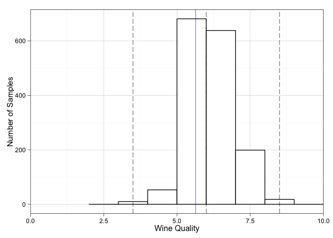
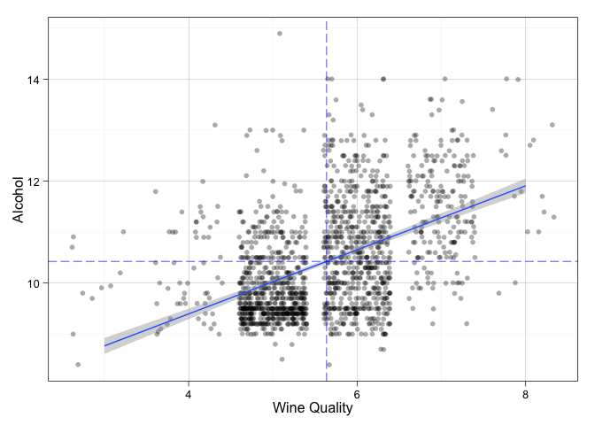
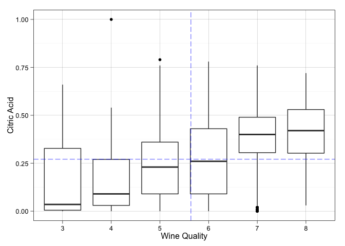
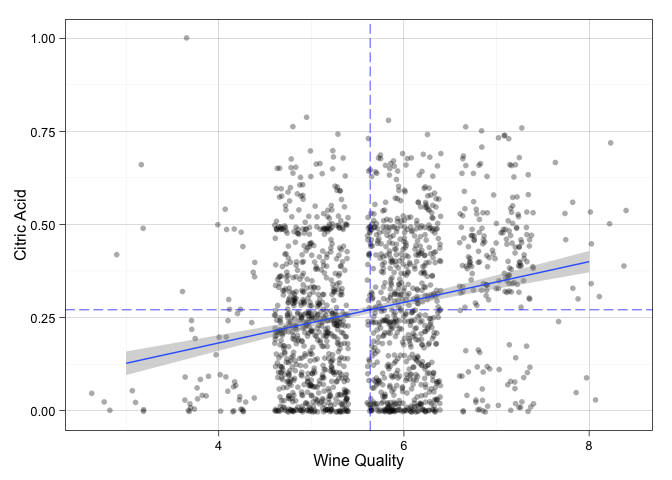
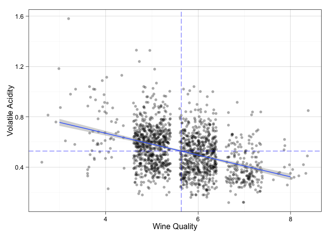
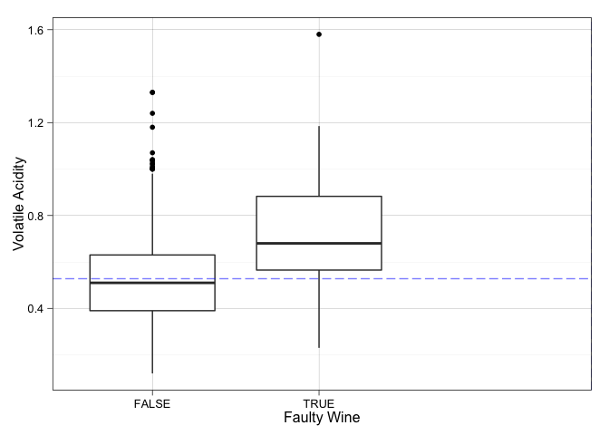
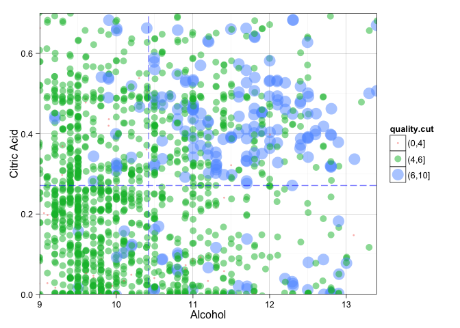

# Red wine quality Data Analysis
Jose A. Dianes  
2 March 2015  


## About the dataset  

This dataset is public available for research. The details are described in
[Cortez et al., 2009].  
  
  P. Cortez, A. Cerdeira, F. Almeida, T. Matos and J. Reis. 
  *Modeling wine preferences by data mining from physicochemical properties.*
  In Decision Support Systems, Elsevier, 47(4):547-553. ISSN: 0167-9236.  

Available at:  
  
  - [Elsevier](http://dx.doi.org/10.1016/j.dss.2009.05.016)  
  - [Pre-press (pdf)](http://www3.dsi.uminho.pt/pcortez/winequality09.pdf)  
  - [bib](http://www3.dsi.uminho.pt/pcortez/dss09.bib)  

### Variable description  

Description of attributes:  

1. **Fixed acidity**: most acids involved with wine or fixed or nonvolatile (do not evaporate readily)  
2. **Volatile acidity**: the amount of acetic acid in wine, which at too high of levels can lead to an unpleasant, vinegar taste  
3. **Citric acid**: found in small quantities, citric acid can add 'freshness' and flavor to wines  
4. **Residual sugar**: the amount of sugar remaining after fermentation stops, it's rare to find wines with less than 1 gram/liter and wines with greater than 45 grams/liter are considered sweet  
5. **Chlorides**: the amount of salt in the wine  
6. **Free sulfur dioxide**: the free form of SO2 exists in equilibrium between molecular SO2 (as a dissolved gas) and bisulfite ion; it prevents microbial growth and the oxidation of wine  
7. **Total sulfur dioxide**: amount of free and bound forms of S02; in low concentrations, SO2 is mostly undetectable in wine, but at free SO2 concentrations over 50 ppm, SO2 becomes evident in the nose and taste of wine  
8. **Density**: the density of water is close to that of water depending on the percent alcohol and sugar content 
9. **pH**: describes how acidic or basic a wine is on a scale from 0 (very acidic) to 14 (very basic); most wines are between 3-4 on the pH scale  
10. **Sulphates**: a wine additive which can contribute to sulfur dioxide gas (S02) levels, wich acts as an antimicrobial and antioxidant  
11. **Alcohol**: the percent alcohol content of the wine  
12. **Quality**: output variable (based on sensory data, score between 0 and 10)  
   
## Questions  

By performing this analysis, we seek to answer the following questions:  

1. How is the quality of the wines tasted?  
2. What is the minimum set of properties and their values that defines a high quality wine?  
3. What are considered wine defects?  

## Data exploration  

First of all, let's load the dataset for red wines in a data frame. We will also
store an aditional variable made of the quality scores as a factor. We will use
it later on for certain type of charts.  


```r
reds <- read.csv("./data/wineQualityReds.csv")
head(reds[,2:13],3)
```

```
##   fixed.acidity volatile.acidity citric.acid residual.sugar chlorides
## 1           7.4             0.70        0.00            1.9     0.076
## 2           7.8             0.88        0.00            2.6     0.098
## 3           7.8             0.76        0.04            2.3     0.092
##   free.sulfur.dioxide total.sulfur.dioxide density   pH sulphates alcohol
## 1                  11                   34  0.9978 3.51      0.56     9.4
## 2                  25                   67  0.9968 3.20      0.68     9.8
## 3                  15                   54  0.9970 3.26      0.65     9.8
##   quality
## 1       5
## 2       5
## 3       5
```

```r
reds$quality_as_factor <- factor(reds$quality, levels=c(0,1,2,3,4,5,6,7,8,9,10))
```

### Wine quality    

Some basic descriptive statistics will familiarise ourselves with the data. 
Although the summary command will give us some of them, we will retrieve them
individually and store them in variables so we can use them accross the report.  

Considering our forst question, let us summarise the **quality**
scores given to each wine in terms of its central tendency and variability.  


```r
reds_quality_min <- min(reds$quality)
reds_quality_max <- max(reds$quality)
reds_quality_mean <- mean(reds$quality)
reds_quality_median <- median(reds$quality)
reds_quality_iqr <- IQR(reds$quality)
reds_quality_q1 <- reds_quality_median - reds_quality_iqr
reds_quality_q3 <- reds_quality_median + reds_quality_iqr
```

The `summary` command gives us already quite a lot of information. We can see
that, although the range of posible scores is from 0 to 10, in our dataset the 
minimum score is 3 and the maximum is 8. 
The mean is 5.6360225 and the median is 6, 
very close to each other. 

What about the mode?  


```r
reds_quality_mode <- names(which.max(table(reds$quality)))
```

So the most given quality score is 5.  

But how disperse is the distribution of quality scores? The IQR goes from 
5 for the lower qartile, to 7 for the 
upper one, around the median of 6 or second quartile. 
We could then consider any quality value of less than 
3.5 or more than 
8.5 an outlier. Do we have any of them?  


```r
reds_outliers <- sum(reds$quality < reds_quality_q1 - 1.5*reds_quality_iqr)
reds_outliers <- reds_outliers + sum(reds$quality > reds_quality_q3 + 1.5*reds_quality_iqr)
```

That is, we have 10 outliers.  

What about the dispersion around the mean?  


```r
reds_quality_sd <- sd(reds$quality)
```

With a standard deviation of 0.8075694, our distribution of quality scores is
not very disperse.

But, let's visualise all this information to reinforce our answer on question 1.  


```r
ggplot(data=reds, aes(x=quality)) +
    geom_bar(binwidth=1, color='black', fill='white') +
    coord_cartesian(xlim=c(0,10)) +
    geom_vline(xintercept = reds_quality_median, linetype='longdash', alpha=.5) +
    geom_vline(xintercept = reds_quality_q1 - 1.5*reds_quality_iqr, linetype='longdash', alpha=.5) +
    geom_vline(xintercept = reds_quality_q3 + 1.5*reds_quality_iqr, linetype='longdash', alpha=.5) +
    geom_vline(xintercept = reds_quality_mean, linetype=1, color='blue', alpha=.5) +
    xlab("Wine Quality") +
    ylab("Number of Samples")
```

 

So if we consider the average quality score to be 5 in a 0 to 10 scale, we can 
see that our quality scores are beyond average under multiple criteria.  

### Influential variables  

Let have a look at how correlated our different variables are.  


```r
cor(x=reds[,2:12], y=reds$quality)
```

```
##                             [,1]
## fixed.acidity         0.12405165
## volatile.acidity     -0.39055778
## citric.acid           0.22637251
## residual.sugar        0.01373164
## chlorides            -0.12890656
## free.sulfur.dioxide  -0.05065606
## total.sulfur.dioxide -0.18510029
## density              -0.17491923
## pH                   -0.05773139
## sulphates             0.25139708
## alcohol               0.47616632
```

From previous we see that the following variables are correlated with
quality:  

- Alcohol (+++)  
- Volatile acidity (---)  

- Citric acid (++)

- Fixed acidity (+)  
- Sulphates ?? worht investigating (+)  
- Total sulphur dioxide (-)  
- Density (-)  
- Chlorides (-)  

We will concentrate in the first three variables that show stronger correlation
with quality.  


#### Alcohol  

Alcohol contributes to a wine's *body* perception during taste and also to its 
balance vs acidity and tanicity (just for reds).  

First of all, a quick summary of the differnet alcohol values.  


```r
summary(reds$alcohol)
```

```
##    Min. 1st Qu.  Median    Mean 3rd Qu.    Max. 
##    8.40    9.50   10.20   10.42   11.10   14.90
```

```r
reds_alcohol_mean <- mean(reds$alcohol)
reds_alcohol_median <- median(reds$alcohol)
```

In order to understand the relationship between alcohol and quality, we will do
two things. First we will inspect how the alcohol values are distributed accross 
the different quality scores. Then we will analyse how they change together.  

For example, what is the average alcohol level for each quality score? We can 
quickly see this by using the `dplyr` library or just by using the `tapply` command.  


```r
tapply(reds$alcohol, reds$quality, mean)
```

```
##         3         4         5         6         7         8 
##  9.955000 10.265094  9.899706 10.629519 11.465913 12.094444
```

And in a visual way, alcohol by quality level, together with the median for the 
whole distribution and the mean for the quality scores.  


```r
ggplot(data=reds, aes(x=quality_as_factor, y=alcohol)) +
    geom_boxplot() +
    geom_hline(show_guide=T, yintercept=reds_alcohol_mean, linetype='longdash', alpha=.5, color='blue') +
    geom_vline(xintercept = reds_quality_mean-reds_quality_min+1, linetype='longdash', color='blue', alpha=.5) +
    xlab("Wine Quality") +
    ylab("Alcohol")
```

 

We can see how wine scores that are beyond the mean quality value of 
5.6360225, also tend to show values beyond the mean alcohol 
value of 10.4229831.  

We already see a tendency in the boxplots. But let's use a scatter plot here, 
including a linear regression line.   


```r
ggplot(data=reds, aes(x=as.numeric(quality), y=alcohol)) +
    geom_jitter(alpha=1/3) +
    geom_smooth(method='lm', aes(group = 1))+
    geom_hline(yintercept=reds_alcohol_mean, linetype='longdash', alpha=.5, color='blue') +
    geom_vline(xintercept = reds_quality_mean, linetype='longdash', color='blue', alpha=.5) +
    xlab("Wine Quality") +
    ylab("Alcohol")
```

 

#### Citric acid  

And as a third variable, let's perform a similar analysis for citric acid. Remember
that this one is not so strongly correlated as the previous ones.  


```r
summary(reds$citric.acid)
```

```
##    Min. 1st Qu.  Median    Mean 3rd Qu.    Max. 
##   0.000   0.090   0.260   0.271   0.420   1.000
```

```r
reds_citric.acid_mean <- mean(reds$citric.acid)
reds_citric.acid_median <- median(reds$citric.acid)
reds_citric.acid_sd <- sd(reds$citric.acid)
reds_citric.acid_max <- max(reds$citric.acid)
caout <- (reds_citric.acid_max - reds_citric.acid_mean) / reds_citric.acid_sd
```

The mean value for the citric acid is 0.2709756 with
a standard deviation of 0.1948011. As a note, the maximum value 
for citric acid is 1. That is 3.7424031 standard
deviations beyond the mean! Again, probably an outlier.   

And now the relationship between this variable and the quality score.  


```r
tapply(reds$citric.acid, reds$quality, mean)
```

```
##         3         4         5         6         7         8 
## 0.1710000 0.1741509 0.2436858 0.2738245 0.3751759 0.3911111
```

And in a visual way, citric acid by quality level, together with the mean for the 
whole distribution and the mean for the quality scores.  


```r
ggplot(data=reds, aes(x=quality_as_factor, y=citric.acid)) +
    geom_boxplot() +
    geom_hline(show_guide=T, yintercept=reds_citric.acid_mean, linetype='longdash', alpha=.5, color='blue') +
    geom_vline(xintercept = reds_quality_mean-reds_quality_min+1, linetype='longdash', color='blue', alpha=.5) +
    xlab("Wine Quality") +
    ylab("Citric Acid")
```

 


```r
ggplot(data=reds, aes(x=as.numeric(quality), y=citric.acid)) +
    geom_jitter(alpha=1/3) +
    geom_smooth(method='lm', aes(group = 1))+
    geom_hline(yintercept=reds_citric.acid_mean, linetype='longdash', alpha=.5, color='blue') +
    geom_vline(xintercept = reds_quality_mean, linetype='longdash', color='blue', alpha=.5) +
    xlab("Wine Quality") +
    ylab("Citric Acid")
```

 

Again, we can see a tendency. Good wines tend to have higher citric acid levels.  

### Faulty wines  

What characteristics can we see influence wine quality negatively?  

#### Voltile acidity  

Let's perform a similar analysis for volatile acidity.  


```r
summary(reds$volatile.acidity)
```

```
##    Min. 1st Qu.  Median    Mean 3rd Qu.    Max. 
##  0.1200  0.3900  0.5200  0.5278  0.6400  1.5800
```

```r
reds_volatile.acidity_mean <- mean(reds$volatile.acidity)
reds_volatile.acidity_median <- median(reds$volatile.acidity)
reds_volatile.acidity_sd <- sd(reds$volatile.acidity)
reds_volatile.acidity_max <- max(reds$volatile.acidity)
vaout <- (reds_volatile.acidity_max - reds_volatile.acidity_mean) / reds_volatile.acidity_sd
```

The mean value for the volatile acidity is 0.5278205 with
a standard deviation of 0.1790597. As a note, the maximum value 
for volatile acidity is 1.58. That is 5.8761378 standard
deviations beyond the mean! Probably an outlier...  

And now the relationship between this variable and the quality score.  


```r
tapply(reds$volatile.acidity, reds$quality, mean)
```

```
##         3         4         5         6         7         8 
## 0.8845000 0.6939623 0.5770411 0.4974843 0.4039196 0.4233333
```

And in a visual way, volatile acidity by quality level, together with the median for the 
whole distribution and the mean for the quality scores.  


```r
ggplot(data=reds, aes(x=quality_as_factor, y=volatile.acidity)) +
    geom_boxplot() +
    geom_hline(show_guide=T, yintercept=reds_volatile.acidity_mean, linetype='longdash', alpha=.5, color='blue') +
    geom_vline(xintercept = reds_quality_mean-reds_quality_min+1, linetype='longdash', color='blue', alpha=.5) +
    xlab("Wine Quality") +
    ylab("Volatile Acidity")
```

 


```r
ggplot(data=reds, aes(x=as.numeric(quality), y=volatile.acidity)) +
    geom_jitter(alpha=1/3) +
    geom_smooth(method='lm', aes(group = 1))+
    geom_hline(yintercept=reds_volatile.acidity_mean, linetype='longdash', alpha=.5, color='blue') +
    geom_vline(xintercept = reds_quality_mean, linetype='longdash', color='blue', alpha=.5) +
    xlab("Wine Quality") +
    ylab("Volatile Acidity")
```

 

In each step we can see the negative influence of volatile acidity in a 
wine's quality score.  

#### Another way to look at it  

Let us say we consider faulty wines those that do not get a score of at least 5
in the scale given (0 to 10). Let us then define a new variable faulty that takes
a boolean value based on that.  


```r
reds <- transform(reds, is.faulty = quality<5)
```

How many faulty wines do we have?  


```r
faulty.reds <- table(reds$is.faulty)
```

We can see a faulty wines ratio of 0.0410156 .  

From those variables we determined were highly correlated, let us see which ones
are characteristic of faulty wines and at what levels. Boxplots are ideal for 
this purpose. Let us start with *volatile acidity*.  


```r
ggplot(data=reds, aes(x=is.faulty, y=volatile.acidity)) +
    geom_boxplot() +
    geom_hline(show_guide=T, yintercept=reds_volatile.acidity_mean, linetype='longdash', alpha=.5, color='blue') +
    geom_vline(xintercept = reds_quality_mean-reds_quality_min+1, linetype='longdash', color='blue', alpha=.5) +
    xlab("Faulty Wine") +
    ylab("Volatile Acidity")
```

 

```r
summary(subset(reds, is.faulty)$volatile.acidity)
```

```
##    Min. 1st Qu.  Median    Mean 3rd Qu.    Max. 
##  0.2300  0.5650  0.6800  0.7242  0.8825  1.5800
```


What about *alcohol*? Maybe there is a minimum threshold under that a wine is perceived as faulty?   


```r
ggplot(data=reds, aes(x=is.faulty, y=alcohol)) +
    geom_boxplot() +
    geom_hline(show_guide=T, yintercept=reds_alcohol_mean, linetype='longdash', alpha=.5, color='blue') +
    geom_vline(xintercept = reds_quality_mean-reds_quality_min+1, linetype='longdash', color='blue', alpha=.5) +
    xlab("Faulty Wine") +
    ylab("Alcohol")
```

 

```r
summary(subset(reds, is.faulty)$alcohol)
```

```
##    Min. 1st Qu.  Median    Mean 3rd Qu.    Max. 
##    8.40    9.60   10.00   10.22   11.00   13.10
```

In this case the answer is clearly no. Although faulty wines tend to have slightly
less alcohol than non faulty ones, their ranges pretty much overlap. We will talk a
bit more about this in the summary. 

These were the two mainly correlated variables. But let us explore some other variables.  

Next let us try with *citric acid* that typically defines fresh wines.  


```r
ggplot(data=reds, aes(x=is.faulty, y=citric.acid)) +
    geom_boxplot() +
    geom_hline(show_guide=T, yintercept=reds_citric.acid_mean, linetype='longdash', alpha=.5, color='blue') +
    geom_vline(xintercept = reds_quality_mean-reds_quality_min+1, linetype='longdash', color='blue', alpha=.5) +
    xlab("Faulty Wine") +
    ylab("Citric Acid")
```

 

```r
summary(subset(reds, is.faulty)$citric.acid)
```

```
##    Min. 1st Qu.  Median    Mean 3rd Qu.    Max. 
##  0.0000  0.0200  0.0800  0.1737  0.2700  1.0000
```

This might be and important one, yes. We can confirm this using the correlation
between both variables.  


```r
cor(x=reds$volatile.acidity, y=reds$citric.acid)
```

```
## [1] -0.5524957
```


## Summary

Recalling our original questions:  

1. How is the quality of the wines tasted?  
2. What is the minimum set of properties and their values that defines a high quality wine?  
3. What are considered wine defects?  
Citric acid seems to influence wine quality in a way that, when is too low, the wine
is considered faulty.  

We already saw that our dataset contains wines over average. This is specially clear
in the scores distribution chart.  


```r
library(ggplot2)
ggplot(data=reds, aes(x=quality)) +
    geom_bar(binwidth=1, color='black', fill='white') +
    coord_cartesian(xlim=c(0,10)) +
    geom_vline(xintercept = reds_quality_median, linetype='longdash', alpha=.5) +
    geom_vline(xintercept = reds_quality_q1 - 1.5*reds_quality_iqr, linetype='longdash', alpha=.5) +
    geom_vline(xintercept = reds_quality_q3 + 1.5*reds_quality_iqr, linetype='longdash', alpha=.5) +
    geom_vline(xintercept = reds_quality_mean, linetype=1, color='blue', alpha=.5) +
    xlab("Wine Quality") +
    ylab("# Samples")
```

 

So if we consider the average quality score to be 5 in a 0 to 10 scale, we can 
see that our quality scores are beyond average under multiple criteria. 

About good wines. It seems clear that they have certain levels of alcohol and citric
acid, and lack of defects. We already saw charts and distribution in previous 
sections showing a positive correlation between these variable and quality. 
So let's try a new plot here. Let's plot alcohol vs citric acid so we devide the
chart area y quadrants. Then let's color each plot using the quality score and see
where good wines fall.  


```r
reds$quality.cut <- cut(reds$quality, breaks=c(0,4,6,10))
ggplot(data=reds, aes(x=alcohol, y=citric.acid)) +
    coord_cartesian(
        xlim=c(quantile(reds$alcohol,.01),quantile(reds$alcohol,.99)),
        ylim=c(quantile(reds$citric.acid,.01),quantile(reds$citric.acid,.99))
        ) +
    geom_jitter(alpha=.5, aes(size=quality.cut, color=quality.cut)) +
    geom_vline(xintercept = reds_alcohol_mean, linetype='longdash', color='blue', alpha=.5) +
    geom_hline(yintercept = reds_citric.acid_mean, linetype='longdash', color='blue', alpha=.5) +
    xlab("Alcohol") +
    ylab("Citric Acid")
```

 

In order to improve clarity, we have defined a cut in the scores.  

Something interesting emerge from this chart. And is that
good wines concentrate in the ipper right quadrant. That is, even when alcohol and
citric acid sometimes produce high quality wines in isolation it is when we have
certain levels of both when we have a more high quality scores. This is related 
with the concept of gustative **balance** in a wine, where the alcohol body and 
sweet feeling balances with citric acid.  

What about defects? We already saw thet *volatile acidity* is very determinant
for faulty wines. We also saw that alcohol is not. Both faulty and correct wines
have similar distributions of levels of alcohol. And we finally saw that a high
level of citric acid is associated with less faulty wines.  

What about wines that, under the previous premises, have
high level of volatile acidity? Our plot is getting a bit too complicated, so
let's try using tables. We will make use of our previously defined 
variable `isFaulty`. We also want to assign one of the previous quadrants to each
wine. They are separated by the axis mean values, so it should be easy.    


```r
reds <- transform(
        reds,
        quadrant = ifelse(alcohol>reds_alcohol_mean,
                          ifelse(citric.acid>reds_citric.acid_mean,4,2),
                          ifelse(citric.acid>reds_citric.acid_mean,3,1))
    )
```

These are the quadrants:  

  * Quadrant 1: wines low in alcohol and citric acid.  
  * Quadrant 2: wines high in alcohol but low in citric acid.  
  * Quadrant 3: wines low in alcohol but high in citric acid.  
  * Quadrant 4: wines in balance with high alcohol and citric acid.  
  
Let's table each quadrant to see what we have.  


```r
table(reds$quadrant)
```

```
## 
##   1   2   3   4 
## 561 291 355 392
```

Let's see the proportions of faulty wines in each quadrant.  


```r
sort(tapply(reds$is.faulty, reds$quadrant, mean))
```

```
##           4           3           1           2 
## 0.005102041 0.036619718 0.048128342 0.072164948
```

That is, there is a lower proportion of faulty wines in the 4th quadrant, etc.  

So finally, what about the volatile acidity level?


```r
sort(tapply(reds$volatile.acidity>reds_volatile.acidity_mean, reds$quadrant, mean))
```

```
##         4         3         2         1 
## 0.1045918 0.2901408 0.6907216 0.7807487
```

Again, the proportion of wines with a high level of volatile acidity, typically produced
by acetic bacteries present in vinegar, is lower in the 4th quadrant and higher in 
the 1st one. We can also see that there is a considerable gap between 3rd quadrant
and the lower two, due to the reduction effect of citric acid on volatile 
acidity (negative correlation).  


```r
cor(x=reds$volatile.acidity, y=reds$citric.acid)
```

```
## [1] -0.5524957
```

## Reflections  

There are many other factors that are related with good wines. Many of them are related with
smells and flavours and not with chemical properties and gustative perceptions like 
these that we have in our dataset. Although our variables are kind of explanatory of
what we have, we have also seen some cases where the must be other explanations for high
or low quality levels.  

However, within our limitations, we have discover the very interesting concept
of gustative balance between alcohol and acidity, and how important is for a wine
to be free of defects.  


