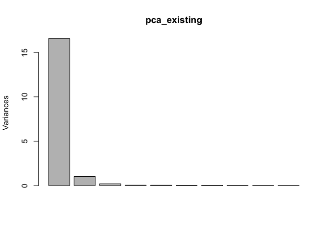
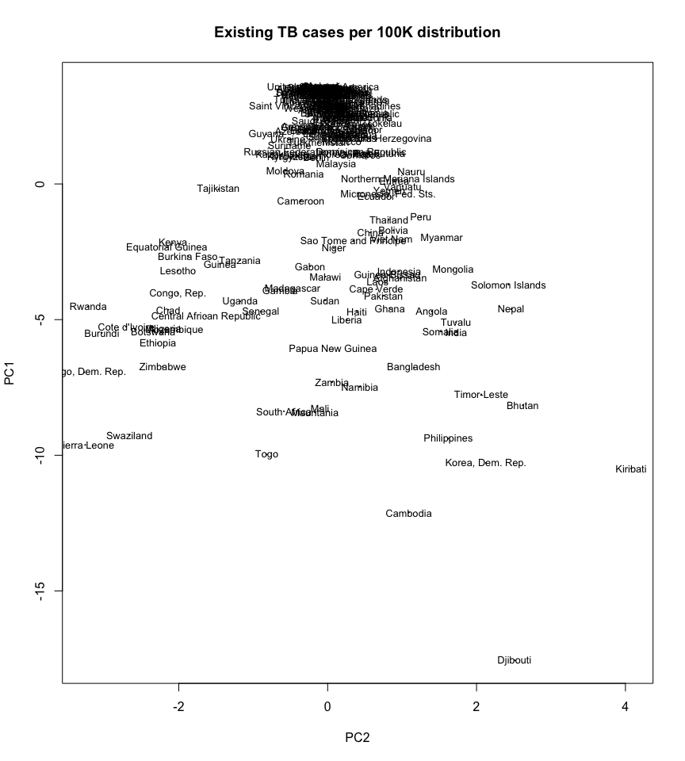
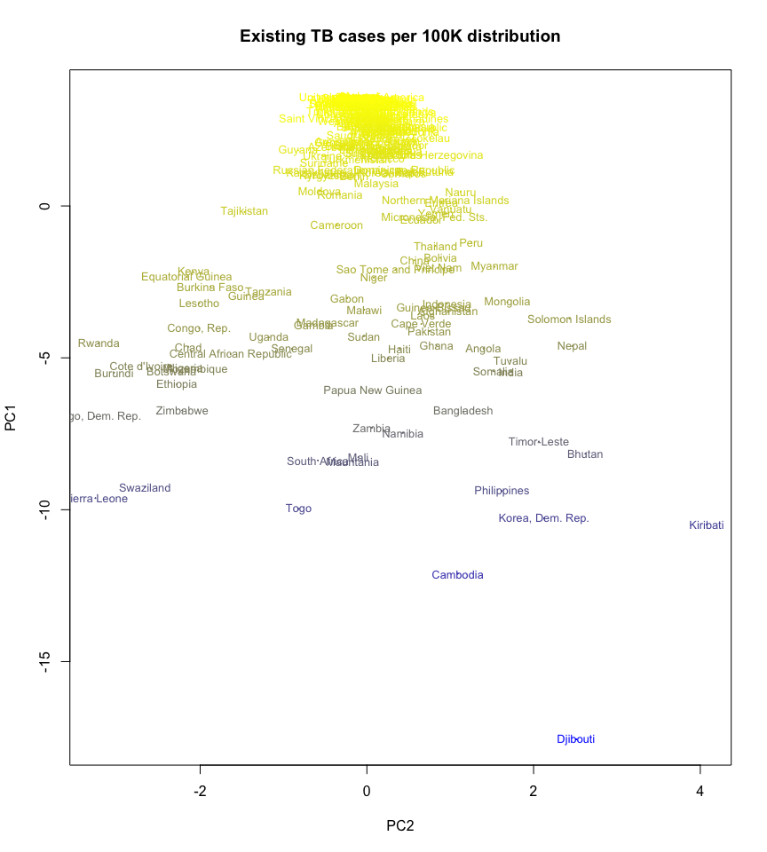
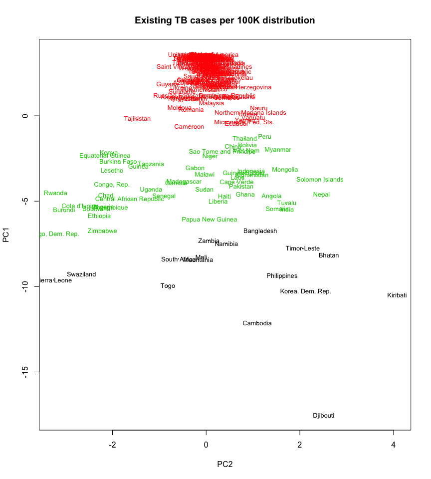
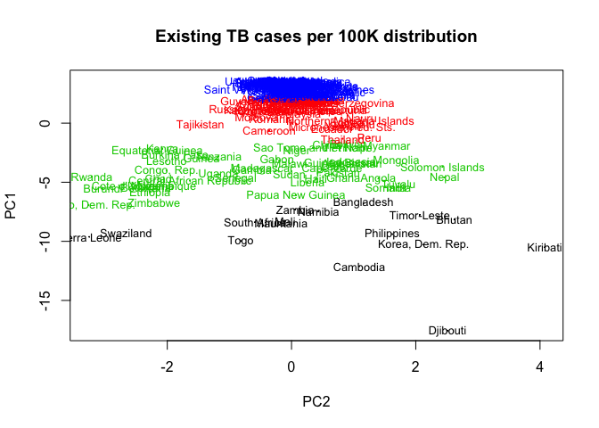
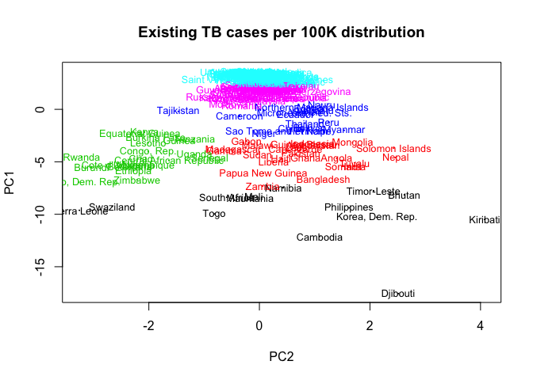

# Dimensionality Reduction and Clustering
Jose A. Dianes  
27 July 2015  

## Getting data  

In R, you use `read.csv` to read CSV files into `data.frame` variables. Although the R function `read.csv` can work with URLs, https is a problem for R in many cases, so you need to use a package like RCurl to get around it.  


```r
library(RCurl)
```

```
## Loading required package: bitops
```

```r
# Get and process existing cases file
existing_cases_file <- getURL("https://docs.google.com/spreadsheets/d/1X5Jp7Q8pTs3KLJ5JBWKhncVACGsg5v4xu6badNs4C7I/pub?gid=0&output=csv")
existing_df <- read.csv(text = existing_cases_file, row.names=1, stringsAsFactor=F)
existing_df[c(1,2,3,4,5,6,15,16,17,18)] <- 
    lapply( existing_df[c(1,2,3,4,5,6,15,16,17,18)], 
            function(x) { as.integer(gsub(',', '', x) )})
```


## PCA  

The default R package `stats` comes with function `prcomp()` to perform principal component analysis. This means that we don’t need to install anything (although there are other options using external packages). This is perhaps the quickest way to do a PCA, and I recommend you to call `?prcomp` in your R console if you're interested in the details of how to fine tune the PCA process with this function.  


```r
pca_existing <- prcomp(existing_df, scale. = TRUE)
```

The resulting object contains several pieces of information related with principal component analysis. We are interested in the scores, that we have in `pca_existing$x`. We got 18 different principal components. Remember that the total number of PCs corresponds to the total number of variables in the dataset, although we normally don't want to use all of them but the subset that corresponds to our purposes.  

In our case we will use the first two. How much variation is explained by each one? In R we can use the `plot` function that comes with the PCA result for that.  


```r
plot(pca_existing)
```

 

Most variation is explained by the first PC. So let's use the first two PCs to represent all of our countries in a scatterplot.  


```r
scores_existing_df <- as.data.frame(pca_existing$x)
# Show first two PCs for head countries
head(scores_existing_df[1:2])
```

```
##                      PC1          PC2
## Afghanistan    -3.490274  0.973495650
## Albania         2.929002  0.012141345
## Algeria         2.719073 -0.184591877
## American Samoa  3.437263  0.005609367
## Andorra         3.173621  0.033839606
## Angola         -4.695625  1.398306461
```

Now that we have them in a data frame, we can use them with `plot`.  


```r
plot(PC1~PC2, data=scores_existing_df, 
     main= "Existing TB cases per 100K distribution",
     cex = .1, lty = "solid")
text(PC1~PC2, data=scores_existing_df, 
     labels=rownames(existing_df),
     cex=.8)
```

 

Let's set the color associated with the mean value for all the years. We will use functions `rgb`, `ramp`, and `rescale` to create a color palette from yellow (lower values) to blue (higher values).    


```r
library(scales)
ramp <- colorRamp(c("yellow", "blue"))
colours_by_mean <- rgb( 
    ramp( as.vector(rescale(rowMeans(existing_df),c(0,1)))), 
    max = 255 )
plot(PC1~PC2, data=scores_existing_df, 
     main= "Existing TB cases per 100K distribution",
     cex = .1, lty = "solid", col=colours_by_mean)
text(PC1~PC2, data=scores_existing_df, 
     labels=rownames(existing_df),
     cex=.8, col=colours_by_mean)
```

 

Now let's associate colour with total sum.  


```r
ramp <- colorRamp(c("yellow", "blue"))
colours_by_sum <- rgb( 
    ramp( as.vector(rescale(rowSums(existing_df),c(0,1)))), 
    max = 255 )
plot(PC1~PC2, data=scores_existing_df, 
     main= "Existing TB cases per 100K distribution",
     cex = .1, lty = "solid", col=colours_by_sum)
text(PC1~PC2, data=scores_existing_df, 
     labels=rownames(existing_df),
     cex=.8, col=colours_by_sum)
```

 

And finally let's associate it with percentage of variation.  

- TODO

## Clustering  

Obtaining clusters in R is as simple as calling to `kmeans`. The function has several parameters, but we will just use all the defaults and start trying with different values of k.  

Let's start with `k=3` asuming that at least, the are countries in a really bad situation, countries in a good situation, and some of them in between.  


```r
set.seed(1234)
existing_clustering <- kmeans(existing_df, centers = 3)
```

The result contains a list with components:  

- `cluster`: A vector of integers indicating the cluster to which each point is allocated.  
- `centers`: A matrix of cluster centres.  
- `withinss`: The within-cluster sum of square distances for each cluster.  
- `size`: The number of points in each cluster.  

Let's colour our previous scatter plot based on what cluster each country belongs to.  


```r
existing_cluster_groups <- existing_clustering$cluster
plot(PC1~PC2, data=scores_existing_df, 
     main= "Existing TB cases per 100K distribution",
     cex = .1, lty = "solid", col=existing_cluster_groups)
text(PC1~PC2, data=scores_existing_df, 
     labels=rownames(existing_df),
     cex=.8, col=existing_cluster_groups)
```

 

Most clusters are based on the first PC. That means that clusters are just defined in terms of the total number of cases per 100K and not how the data evolved on time (PC2). So let's try with `k=4` and see if some of these cluster are refined in the direction of the second PC.  


```r
set.seed(1234)
existing_clustering <- kmeans(existing_df, centers = 4)
existing_cluster_groups <- existing_clustering$cluster
plot(PC1~PC2, data=scores_existing_df, 
     main= "Existing TB cases per 100K distribution",
     cex = .1, lty = "solid", col=existing_cluster_groups)
text(PC1~PC2, data=scores_existing_df, 
     labels=rownames(existing_df),
     cex=.8, col=existing_cluster_groups)
```

 

There is more refinement, but again is in the direction of the first PC. Let's try then with `k=5`.  


```r
set.seed(1234)
existing_clustering <- kmeans(existing_df, centers = 5)
existing_cluster_groups <- existing_clustering$cluster
plot(PC1~PC2, data=scores_existing_df, 
     main= "Existing TB cases per 100K distribution",
     cex = .1, lty = "solid", col=existing_cluster_groups)
text(PC1~PC2, data=scores_existing_df, 
     labels=rownames(existing_df),
     cex=.8, col=existing_cluster_groups)
```

 

There we have it. Right in the middle we have a cluster that has been split in two different ones in the direction of the second PC. What if we try with `k=6`?  


```r
set.seed(1234)
existing_clustering <- kmeans(existing_df, centers = 6)
existing_cluster_groups <- existing_clustering$cluster
plot(PC1~PC2, data=scores_existing_df, 
     main= "Existing TB cases per 100K distribution",
     cex = .1, lty = "solid", col=existing_cluster_groups)
text(PC1~PC2, data=scores_existing_df, 
     labels=rownames(existing_df),
     cex=.8, col=existing_cluster_groups)
```

 

We get some diagonal split in the second top cluster. That surely contains some interesting information, but let's revert to our `k=5` case and later on we will see how to use a different refinement process with clusters are too tight like we have at the top of the plot.  


```r
set.seed(1234)
existing_clustering <- kmeans(existing_df, centers = 5)
existing_cluster_groups <- existing_clustering$cluster
plot(PC1~PC2, data=scores_existing_df, 
     main= "Existing TB cases per 100K distribution",
     cex = .1, lty = "solid", col=existing_cluster_groups)
text(PC1~PC2, data=scores_existing_df, 
     labels=rownames(existing_df),
     cex=.8, col=existing_cluster_groups)
```

 

## Analysing clusters

Most of the work in this section is about data frame indexing. There isn't anything sophisticated about the code we will use, so we will pick up one of our languages and perform the whole thing (we will use R this time). In order to analyise each cluster, let's add a column in our data frame containing the cluster ID. We will use that for subsetting.  


```r
existing_df$cluster <- existing_clustering$cluster
table(existing_df$cluster)
```

```
## 
##  1  2  3  4  5 
## 16 30 20 51 90
```

The last line shows how many countries do we have in each cluster.  

### Centroids comparison chart  

Let's start by creating a line chart that compares the time series for each cluster centroid. This chart will helps us better understand our cluster results.  


```r
xrange <- 1990:2007
plot(xrange, existing_clustering$centers[1,], 
     type='l', xlab="Year", 
     ylab="New cases per 100K", 
     col = 1, 
     ylim=c(0,1000))
for (i in 2:nrow(existing_clustering$centers)) {
    lines(xrange, existing_clustering$centers[i,],
    col = i)
}
legend(x=1990, y=1000, 
       lty=1, cex = 0.5,
       ncol = 5,
       col=1:(nrow(existing_clustering$centers)+1),
       legend=paste("Cluster",1:nrow(existing_clustering$centers)))
```

 

### Cluster 1  

Cluster 1 contains just 16 countries. These are:  


```r
rownames(subset(existing_df, cluster==1))
```

```
##  [1] "Bangladesh"       "Bhutan"           "Cambodia"        
##  [4] "Korea, Dem. Rep." "Djibouti"         "Kiribati"        
##  [7] "Mali"             "Mauritania"       "Namibia"         
## [10] "Philippines"      "Sierra Leone"     "South Africa"    
## [13] "Swaziland"        "Timor-Leste"      "Togo"            
## [16] "Zambia"
```

The centroid that represents them is:


```r
existing_clustering$centers[1,]
```

```
##    X1990    X1991    X1992    X1993    X1994    X1995    X1996    X1997 
## 764.0000 751.1875 734.9375 718.0625 701.6875 687.3125 624.7500 621.6250 
##    X1998    X1999    X2000    X2001    X2002    X2003    X2004    X2005 
## 605.1875 609.4375 622.0000 635.5000 604.2500 601.1250 597.3750 601.1250 
##    X2006    X2007 
## 600.2500 595.7500
```

These are by all means countries with the most tuberculosis cases every year. We can see in the carht that this is the top line, although the number of cases descends progressively.  

### Cluster 2  

Cluster 2 contains 30 countries. These are:  


```r
rownames(subset(existing_df, cluster==2))
```

```
##  [1] "Afghanistan"           "Angola"               
##  [3] "Bolivia"               "Cape Verde"           
##  [5] "China"                 "Gabon"                
##  [7] "Gambia"                "Ghana"                
##  [9] "Guinea-Bissau"         "Haiti"                
## [11] "India"                 "Indonesia"            
## [13] "Laos"                  "Liberia"              
## [15] "Madagascar"            "Malawi"               
## [17] "Mongolia"              "Myanmar"              
## [19] "Nepal"                 "Niger"                
## [21] "Pakistan"              "Papua New Guinea"     
## [23] "Peru"                  "Sao Tome and Principe"
## [25] "Solomon Islands"       "Somalia"              
## [27] "Sudan"                 "Thailand"             
## [29] "Tuvalu"                "Viet Nam"
```

The centroid that represents them is:


```r
existing_clustering$centers[2,]
```

```
##    X1990    X1991    X1992    X1993    X1994    X1995    X1996    X1997 
## 444.5000 435.2000 426.1667 417.4000 409.2333 400.5667 378.6000 365.3667 
##    X1998    X1999    X2000    X2001    X2002    X2003    X2004    X2005 
## 358.0333 354.4333 350.6000 326.7333 316.1667 308.5000 297.8667 288.8000 
##    X2006    X2007 
## 284.9667 280.8000
```

It is a relatively large cluster. Still countries with lots of cases, but definitively less than the first cluster. We see countries such as India or China here, the larger countries on earth (from a previous tutorial we know that China itself has reduced its cases by 85%) and american countries such as Peru or Bolivia. In fact, this is the cluster with the fastest decrease in the number of existing cases as we see in the line chart.   

### Cluster 3  

This is an important one. Cluster 3 contains just 20 countries. These are:  


```r
rownames(subset(existing_df, cluster==3))
```

```
##  [1] "Botswana"                 "Burkina Faso"            
##  [3] "Burundi"                  "Central African Republic"
##  [5] "Chad"                     "Congo, Rep."             
##  [7] "Cote d'Ivoire"            "Congo, Dem. Rep."        
##  [9] "Equatorial Guinea"        "Ethiopia"                
## [11] "Guinea"                   "Kenya"                   
## [13] "Lesotho"                  "Mozambique"              
## [15] "Nigeria"                  "Rwanda"                  
## [17] "Senegal"                  "Uganda"                  
## [19] "Tanzania"                 "Zimbabwe"
```

The centroid that represents them is:


```r
existing_clustering$centers[3,]
```

```
##  X1990  X1991  X1992  X1993  X1994  X1995  X1996  X1997  X1998  X1999 
## 259.85 278.90 287.30 298.05 309.00 322.95 335.00 357.65 369.65 410.85 
##  X2000  X2001  X2002  X2003  X2004  X2005  X2006  X2007 
## 422.25 463.75 492.45 525.25 523.60 519.90 509.80 513.50
```

This is the only cluster where the number of cases has increased over the years, and is about to overtake the first position by 2007. Each of these countries are probably in the middle of an humanitarian crisis and probably beeing affected by other infectious diseases such as HIV. We can confirm here that PC2 is coding mostly that, the percentage of variation over time of the number of exiting cases.  

### Cluster 4  

The fourth cluster contains 51 countries.  


```r
rownames(subset(existing_df, cluster==4))
```

```
##  [1] "Armenia"                  "Azerbaijan"              
##  [3] "Bahrain"                  "Belarus"                 
##  [5] "Benin"                    "Bosnia and Herzegovina"  
##  [7] "Brazil"                   "Brunei Darussalam"       
##  [9] "Cameroon"                 "Comoros"                 
## [11] "Croatia"                  "Dominican Republic"      
## [13] "Ecuador"                  "El Salvador"             
## [15] "Eritrea"                  "Georgia"                 
## [17] "Guam"                     "Guatemala"               
## [19] "Guyana"                   "Honduras"                
## [21] "Iraq"                     "Kazakhstan"              
## [23] "Kyrgyzstan"               "Latvia"                  
## [25] "Lithuania"                "Malaysia"                
## [27] "Maldives"                 "Micronesia, Fed. Sts."   
## [29] "Morocco"                  "Nauru"                   
## [31] "Nicaragua"                "Niue"                    
## [33] "Northern Mariana Islands" "Palau"                   
## [35] "Paraguay"                 "Qatar"                   
## [37] "Korea, Rep."              "Moldova"                 
## [39] "Romania"                  "Russian Federation"      
## [41] "Seychelles"               "Sri Lanka"               
## [43] "Suriname"                 "Tajikistan"              
## [45] "Tokelau"                  "Turkmenistan"            
## [47] "Ukraine"                  "Uzbekistan"              
## [49] "Vanuatu"                  "Wallis et Futuna"        
## [51] "Yemen"
```

Represented by its centroid.  


```r
existing_clustering$centers[4,]
```

```
##     X1990     X1991     X1992     X1993     X1994     X1995     X1996 
## 130.60784 133.41176 125.60784 127.54902 124.82353 127.70588 121.68627 
##     X1997     X1998     X1999     X2000     X2001     X2002     X2003 
## 130.50980 125.82353 124.45098 110.58824 106.60784 121.09804 103.01961 
##     X2004     X2005     X2006     X2007 
## 101.80392  97.29412  96.17647  91.68627
```

This cluster is pretty close to the last and larger one. It contains many american countries, some european countries, etc. Some of them are large and rich, such as Russia or Brazil. Structurally the differece with the countries in Cluster 5 may reside in a larger number of cases per 100K. They also seem to be decreasing the number of cases slightly faster than Cluster 5. These two reasons made k-means cluster them in a different group.  

### Cluster 5  

The last and bigger cluster contains 90 countries.  


```r
rownames(subset(existing_df, cluster==5))
```

```
##  [1] "Albania"                          "Algeria"                         
##  [3] "American Samoa"                   "Andorra"                         
##  [5] "Anguilla"                         "Antigua and Barbuda"             
##  [7] "Argentina"                        "Australia"                       
##  [9] "Austria"                          "Bahamas"                         
## [11] "Barbados"                         "Belgium"                         
## [13] "Belize"                           "Bermuda"                         
## [15] "British Virgin Islands"           "Bulgaria"                        
## [17] "Canada"                           "Cayman Islands"                  
## [19] "Chile"                            "Colombia"                        
## [21] "Cook Islands"                     "Costa Rica"                      
## [23] "Cuba"                             "Cyprus"                          
## [25] "Czech Republic"                   "Denmark"                         
## [27] "Dominica"                         "Egypt"                           
## [29] "Estonia"                          "Fiji"                            
## [31] "Finland"                          "France"                          
## [33] "French Polynesia"                 "Germany"                         
## [35] "Greece"                           "Grenada"                         
## [37] "Hungary"                          "Iceland"                         
## [39] "Iran"                             "Ireland"                         
## [41] "Israel"                           "Italy"                           
## [43] "Jamaica"                          "Japan"                           
## [45] "Jordan"                           "Kuwait"                          
## [47] "Lebanon"                          "Libyan Arab Jamahiriya"          
## [49] "Luxembourg"                       "Malta"                           
## [51] "Mauritius"                        "Mexico"                          
## [53] "Monaco"                           "Montserrat"                      
## [55] "Netherlands"                      "Netherlands Antilles"            
## [57] "New Caledonia"                    "New Zealand"                     
## [59] "Norway"                           "Oman"                            
## [61] "Panama"                           "Poland"                          
## [63] "Portugal"                         "Puerto Rico"                     
## [65] "Saint Kitts and Nevis"            "Saint Lucia"                     
## [67] "Saint Vincent and the Grenadines" "Samoa"                           
## [69] "San Marino"                       "Saudi Arabia"                    
## [71] "Singapore"                        "Slovakia"                        
## [73] "Slovenia"                         "Spain"                           
## [75] "Sweden"                           "Switzerland"                     
## [77] "Syrian Arab Republic"             "Macedonia, FYR"                  
## [79] "Tonga"                            "Trinidad and Tobago"             
## [81] "Tunisia"                          "Turkey"                          
## [83] "Turks and Caicos Islands"         "United Arab Emirates"            
## [85] "United Kingdom"                   "Virgin Islands (U.S.)"           
## [87] "United States of America"         "Uruguay"                         
## [89] "Venezuela"                        "West Bank and Gaza"
```

Represented by its centroid.  


```r
existing_clustering$centers[5,]
```

```
##    X1990    X1991    X1992    X1993    X1994    X1995    X1996    X1997 
## 37.27778 35.68889 35.73333 34.40000 33.51111 32.42222 30.80000 30.51111 
##    X1998    X1999    X2000    X2001    X2002    X2003    X2004    X2005 
## 29.30000 26.77778 24.35556 23.57778 22.02222 20.93333 20.48889 19.92222 
##    X2006    X2007 
## 19.25556 19.11111
```

This cluster is too heterogeneous and probably needs futher refinement. However, it is a good grouping when compared to other distant clusters. In any case it contains those countries with less number of existing cases in our set.    

### A second level of clustering  

So let's do just that quickly. Let's re-cluster the 90 countries in our Cluster 5 in order to firther refine them. As the number of clusters let's use 2. We are just interested in seeing if there are actually two different clusters withing Cluster 5. The reader can of course try to go further and use more than 2 centers.  


```r
# subset the original dataset
cluster5_df <- subset(existing_df, cluster==5)
# do the clustering
set.seed(1234)
cluster5_clustering <- kmeans(cluster5_df[,-19], centers = 2)
# assign sub-cluster number to the data set for Cluster 5
cluster5_df$cluster <- cluster5_clustering$cluster
```

Now we can plot them in order to see if there are actual differences.  


```r
xrange <- 1990:2007
plot(xrange, cluster5_clustering$centers[1,], 
     type='l', xlab="Year", 
     ylab="Existing cases per 100K", 
     col = 1, 
     ylim=c(0,200))
for (i in 2:nrow(cluster5_clustering$centers)) {
    lines(xrange, cluster5_clustering$centers[i,],
    col = i)
}
legend(x=1990, y=200, 
       lty=1, cex = 0.5,
       ncol = 5,
       col=1:(nrow(cluster5_clustering$centers)+1),
       legend=paste0("Cluster 5.",1:nrow(cluster5_clustering$centers)))
```

 

There are actually different tendencies in our data. We can see that there is a group of countries in our original Cluster 5 that is decreasing the number cases at a faster rate, trying to catch up with those countries with a lower number of existing TB cases per 100K.  


```r
rownames(subset(cluster5_df, cluster5_df$cluster==2))
```

```
##  [1] "Albania"                          "Algeria"                         
##  [3] "Anguilla"                         "Argentina"                       
##  [5] "Bahamas"                          "Belize"                          
##  [7] "Bulgaria"                         "Colombia"                        
##  [9] "Egypt"                            "Estonia"                         
## [11] "Fiji"                             "French Polynesia"                
## [13] "Hungary"                          "Iran"                            
## [15] "Japan"                            "Kuwait"                          
## [17] "Lebanon"                          "Libyan Arab Jamahiriya"          
## [19] "Mauritius"                        "Mexico"                          
## [21] "New Caledonia"                    "Panama"                          
## [23] "Poland"                           "Portugal"                        
## [25] "Saint Vincent and the Grenadines" "Samoa"                           
## [27] "Saudi Arabia"                     "Singapore"                       
## [29] "Slovakia"                         "Slovenia"                        
## [31] "Spain"                            "Syrian Arab Republic"            
## [33] "Macedonia, FYR"                   "Tonga"                           
## [35] "Tunisia"                          "Turkey"                          
## [37] "United Arab Emirates"             "Venezuela"                       
## [39] "West Bank and Gaza"
```

While the countries with less number of cases and also slower decreasing rate is.  


```r
rownames(subset(cluster5_df, cluster5_df$cluster==1))
```

```
##  [1] "American Samoa"           "Andorra"                 
##  [3] "Antigua and Barbuda"      "Australia"               
##  [5] "Austria"                  "Barbados"                
##  [7] "Belgium"                  "Bermuda"                 
##  [9] "British Virgin Islands"   "Canada"                  
## [11] "Cayman Islands"           "Chile"                   
## [13] "Cook Islands"             "Costa Rica"              
## [15] "Cuba"                     "Cyprus"                  
## [17] "Czech Republic"           "Denmark"                 
## [19] "Dominica"                 "Finland"                 
## [21] "France"                   "Germany"                 
## [23] "Greece"                   "Grenada"                 
## [25] "Iceland"                  "Ireland"                 
## [27] "Israel"                   "Italy"                   
## [29] "Jamaica"                  "Jordan"                  
## [31] "Luxembourg"               "Malta"                   
## [33] "Monaco"                   "Montserrat"              
## [35] "Netherlands"              "Netherlands Antilles"    
## [37] "New Zealand"              "Norway"                  
## [39] "Oman"                     "Puerto Rico"             
## [41] "Saint Kitts and Nevis"    "Saint Lucia"             
## [43] "San Marino"               "Sweden"                  
## [45] "Switzerland"              "Trinidad and Tobago"     
## [47] "Turks and Caicos Islands" "United Kingdom"          
## [49] "Virgin Islands (U.S.)"    "United States of America"
## [51] "Uruguay"
```

However, we won't likely obtain this clusters by just increasing in 1 the number of centers in our first clustering process with the original dataset. As we said, Cluster 5 seemed like a very cohesive group when compared with more distant countries. This two step clustering process is a useful technique that we can use with any dataset we want to explore.  


